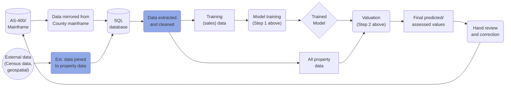

<!-- README.md is generated from README.Rmd. Please edit that file -->

```{r, include = FALSE}
knitr::opts_chunk$set(
  collapse = TRUE,
  comment = "#>",
  fig.path = "man/figures/README-",
  out.width = "100%"
)
```

## Model Overview

The duty of the Cook County Assessor's Office is to value property in a fair, accurate, and transparent way. The Assessor is committed to transparency throughout the assessment process, and as such, this repository contains:

* [Nearly all code used to determine Cook County residential property values](./)
* [Rationale for different modeling, feature, and code decisions that affect assessed property values](#choices-made)
* [An outline of ongoing data quality issues that affect assessed property values](#ongoing-issues)
* [Instructions to replicate our model and results using open data](#installation)

The repository itself contains code for the Computer Assisted Mass Appraisal (CAMA) system used to generate initial assessed values for all single-family and multi-family residential properties in Cook County. This system is effectively an advanced statistical/machine learning model (hereafter referred to as "the model") which uses previous sales to generate predicted values (assessments) for unsold properties. 

Note that data extraction/preparation, feature engineering, and data validation for this model are handled in a [separate repository](https://gitlab.com/ccao-data-science---modeling/processes/etl_res_data). Values for [residential condominiums](https://gitlab.com/ccao-data-science---modeling/models/ccao_condo_avm) and [commercial apartments](https://gitlab.com/ccao-data-science---modeling/models/commercial-apartments-automated-valuation-model) are determined by separate models.

### How It Works

The goal of the model is to answer the question "What would the sale price of every home be if it had sold last year?" To answer this question, we use a two-step process:

1. **Modeling**: First, we use the code in this repository to train an advanced machine learning model. The model predicts the sale price (fair market value) of unsold properties using the known sale price of similar and nearby properties. Training the model involves iteratively updating a mathematical function to recognize patterns in the data. The output of this step is a model object which can be used to predict any property's sale price given a [set of characteristics (such as location, number of bedrooms, etc.)](#features-used).

2. **Valuation**: Second, we use the model created in step one to predict values for all residential properties in Cook County. We then train a secondary, much simpler model (which we call the post-modeling adjustment model) to correct for any systemic bias introduced by the first model. Finally, we combine the first and second model to produce initial assessed property values - the ones printed on Residential Reassessment Notices that are mailed when properties are reassessed. However, note that values produced by the model and mailed values may not be identical, as there are additional rounds of automated and human review between modeling and mailing.

The full residential modeling pipeline, from raw data to mailing assessed values to taxpayers, looks something like:



### Features Used

The residential model uses a variety of individual and aggregate features to determine a property's assessed value. We've tested a long list of possible features over time, including [walk score](https://gitlab.com/ccao-data-science---modeling/models/ccao_res_avm/-/blob/9407d1fae1986c5ce1f5434aa91d3f8cf06c8ea1/output/test_new_variables/county_walkscore.html), [crime rate](https://gitlab.com/ccao-data-science---modeling/models/ccao_res_avm/-/blob/9407d1fae1986c5ce1f5434aa91d3f8cf06c8ea1/output/test_new_variables/chicago_crimerate.html), [school districts](https://gitlab.com/ccao-data-science---modeling/models/ccao_res_avm/-/blob/9407d1fae1986c5ce1f5434aa91d3f8cf06c8ea1/output/test_new_variables/county_school_boundaries_mean_encoded.html), and many others. The features in the table below are the ones that made the cut. They're the right combination of easy to understand and impute, powerfully predictive, and well-behaved. Most of them are in use in the model as of `r Sys.Date()`.

```{r features_used, message=FALSE, echo=FALSE}
library(dplyr)
library(tidyr)
ccao::vars_dict %>%
  filter(var_is_predictor & var_name_standard != "meta_sale_price") %>%
  group_by(var_name_pretty) %>%
  mutate(row = paste0("X", row_number())) %>%
  distinct(
    `Feature Name` = var_name_pretty,
    Category = var_type,
    Type = var_data_type,
    var_value, row
  ) %>%
  mutate(Category = recode(
    Category,
    char = "Characteristic",
    econ = "Economic",
    geo = "Geospatial",
    ind = "Indicator",
    time = "Time",
    meta = "Meta"
  )) %>%
  pivot_wider(
    `Feature Name`:`Type`,
    names_from = row,
    values_from = var_value
  ) %>%
  unite("Possible Values", starts_with("X"), sep = ", ", na.rm = TRUE) %>%
  arrange(Category) %>%
  knitr::kable(format = "markdown")
```

### Sales Used


## Choices Made

- Model type
- Features to include/exclude
- How to trim the sales sample
- post-modeling adjustments

## Ongoing Issues

- Data integrity (wrong characteristics, bad sales, lack of chars)
- Low-value properties
- Multi-codes
- Multi-family
- Land valuation


## Major Changes From V1

- Whole county
- lightgbm
- tidymodels
- split codebase
- dependency management

## FAQs


# Technical Details

Modeling is implemented using the [Tidymodels](https://www.tidymodels.org/) framework for R. 

LightGBM + glmnet (elasticnet)

lgbm integrated with treesnip + custom code

preprocessing in recipes

Tuned according to lgbm docs

Minimized on RMSE

Other models tried


# Replication/Usage

## Installation

## Usage/Files

## Troubleshooting


# Process of Installing and Running Residental Model

-----------------------------------------------

## Steps of Installation and Running

#### Step 1: Clone the repo, Setting Repo as working directory in RStudio
#### Step 2: In RStuio, Install Package Renv and Run renv::restore()
#### Step 3: Ask for Input data and hyperparameter files from Dan

Params file goes output/params folder: 
* cat_params.rds,
* xgb_params.rds,
* lgbm_params.rds,
* Model_timings.rds

Input files goes to input folder:
* nbhdstats.parquet,
* assmntdata.parquet,
* modeldata.parquet

#### Step 4: Run Model.R from ccao_res_avm repo (creates the model and evaluates its performance on a test set)
#### Step 5: Run Valuation.R (gets the predicted values for all the properties we need to assess)
#### Step 6: Run reports: model_report.Rmd & Valuation_report.Rmd for model performance evaluation. 


## Common Bugs:


#### Step 2: Install Package Renv and Run renv::restore() 

Potential Problesm Encountered: 

(1) Error: Failed to retrieve package 'treesnip'
Solution: 
- Manullay install treesnip with instruction:  https://github.com/curso-r/treesnip

(2) Error: 	WARNING: Rtools is required to build R packages, but is not currently installed.

Solution: 
- Install R Tools: https://cran.r-project.org/bin/windows/Rtools/

(3) Error: (converted from warning) package 'parsnip' was built under R version 4.0.3

Solution: 
- try manually installing the dev version of parsnip from github: https://github.com/tidymodels/parsnip

#### Step 4: Run Model.R from ccao_res_avm repo


