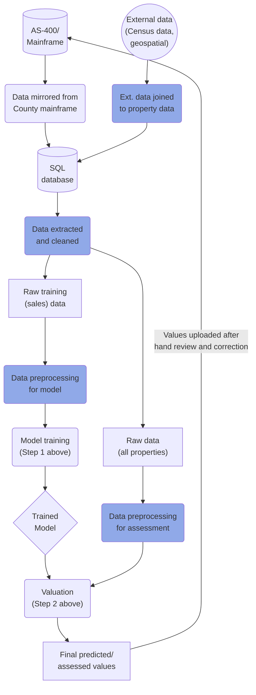
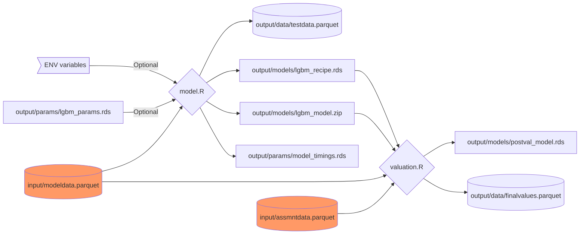
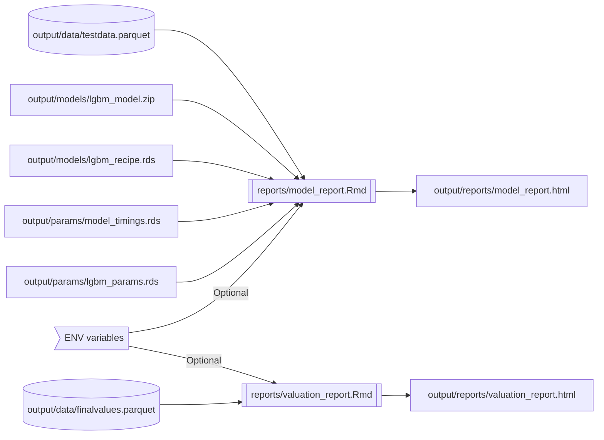

<!-- README.md is generated from README.Rmd. Please edit that file -->

```{r, include = FALSE}
knitr::opts_chunk$set(
  collapse = TRUE,
  comment = "#>",
  fig.path = "docs/figures/",
  out.width = "100%"
)
```

# Model Overview

The duty of the Cook County Assessor's Office is to value property in a fair, accurate, and transparent way. The Assessor is committed to transparency throughout the assessment process. As such, this repository contains:

* [Nearly all code used to determine Cook County residential property values](./model.R).
* [Rationale for different modeling, feature, and code decisions that affect assessed property values](#choices-made).
* [An outline of ongoing data quality issues that affect assessed property values](#ongoing-issues).
* [Instructions to replicate our model and results using open data](#installation).

The repository itself contains code for the Computer Assisted Mass Appraisal (CAMA) system used to generate initial assessed values for all single-family and multi-family residential properties in Cook County. This system is effectively an advanced statistical/machine learning model (hereafter referred to as "the model") which uses previous sales to generate predicted sale values (assessments) for unsold properties. 

Note that data extraction/preparation, feature engineering, and data validation for this model are handled in a [separate repository](https://gitlab.com/ccao-data-science---modeling/processes/etl_res_data). Values for [residential condominiums](https://gitlab.com/ccao-data-science---modeling/models/ccao_condo_avm) and [commercial apartments](https://gitlab.com/ccao-data-science---modeling/models/commercial-apartments-automated-valuation-model) are determined by separate models.

## How It Works

The goal of the model is to answer the question "What would the sale price of every home be if it had sold last year?" To answer this question, we use a two-step process:

1. **Modeling**: First, we use the code in this repository to train an predictive machine learning model. The model predicts the sale price (fair market value) of unsold properties using the known sale price of similar and nearby properties. Training the model involves iteratively updating a mathematical function to recognize patterns in the data. The output of this step is a model object which can be used to predict any property's sale price given a [set of characteristics (such as location, number of bedrooms, etc.)](#features-used).

2. **Valuation**: Second, we use the model created in Step 1 to predict values for all residential properties in Cook County. We then train a secondary, much simpler model (which we call the post-modeling adjustment model) to correct for any systemic bias introduced by the first model. Finally, we combine the first and second model to produce initial assessed property values - the ones printed on Residential Reassessment Notices that are mailed when properties are reassessed. However, note that values produced by the model and mailed values may not be identical, as there are additional rounds of automated and human review between modeling and mailing.

The full residential modeling pipeline, from raw data to final values, looks approximately like the flowchart below. Note that **blue nodes are clickable links to the code responsible for that step**.


## Choices Made

Despite its growing reputation as an easy-to-use panacea, machine learning actually involves a number of choices and trade-offs which are not always transparent or well-justified. Seemingly inane decisions by algorithm creators and data scientists [can introduce systemic bias](https://www.scientificamerican.com/article/how-nist-tested-facial-recognition-algorithms-for-racial-bias/) into results. 

To counter this, we've listed the major choices we've made about our modeling process below, as well as the rationale behind each decision. We feel strongly that these choices lead to optimal results given the trade-offs involved, but we're [absolutely open to suggestions and criticism](#contributing).

### Model Selection

We use [LightGBM](https://lightgbm.readthedocs.io/en/latest/) for our primary valuation model. LightGBM is a GBDT (gradient-boosting decision tree) framework created and maintained by Microsoft. It was only very recently [released officially for R](https://cran.r-project.org/web/packages/lightgbm/index.html), but has been around since 2016. 

We tried a number of other model types and frameworks, including regularized linear models, [XGBoost](https://xgboost.readthedocs.io/en/latest/), [CatBoost](https://catboost.ai/), random forest, shallow neural networks, and support vector machines. We even tried ensemble methods such as [model stacking](https://gitlab.com/ccao-data-science---modeling/models/ccao_res_avm/-/commit/77de50dce86986f8d442f05c161438933c097958). We chose LightGBM because it has the right mix of trade-offs for our needs. Specifically, LightGBM is:

* [Well-documented](https://lightgbm.readthedocs.io/en/latest/). The docs contain good explanations of LightGBM's features and useful troubleshooting sections.
* Highly accurate. It consistently beat other methods in accuracy, as [measured by RMSE (root mean squared error) using a test set](#faqs).
* Extremely fast. It trained faster than other model types by a nearly 2:1 margin using our data (CPU training only).
* [Capable of natively handling categorical features](https://lightgbm.readthedocs.io/en/latest/Advanced-Topics.html#categorical-feature-support). This is extremely important as a large amount of our property data is categorical (type of roof, neighborhood, etc.). Other methods, such as XGBoost, require feature transformation such as one-hot encoding to use categorical data.
* Widely used in housing-specific machine learning models and competitions.
* Simpler to use and implement than ensemble methods or neural networks, which can involve lots of fiddling and configuration.
* Easy to diagnose problems with, as it has built-in feature importance and contribution methods.

The downsides of LightGBM are that it is:

* Relatively difficult to explain compared to simpler models such as linear regression.
* Not particularly well-integrated into [Tidymodels](https://www.tidymodels.org/) (yet), the R framework we use for machine learning.
* Painful to train, since it has a somewhat large number of hyperparameters.
* Prone to over-fitting if not trained carefully, unlike other methods such as random forest.

Additionally, we run a regularized linear model (ElasticNet) to use as a baseline comparison for LightGBM. LightGBM universally outperforms the linear model, particularly in areas with high housing heterogeneity. 

### Hyperparameter Selection

[Hyperparameters](https://en.wikipedia.org/wiki/Hyperparameter_(machine_learning)) define the structure and trade-offs of models. They must be well-specified in order for a model to be accurate and useful. LightGBM has a large number of tunable parameters, but we train the most important six in our model. These parameters are:

| LightGBM<br>Parameter                                                                            | Tidymodels<br>Equivalent | Parameter Description                                                                                                                                                                                                                          |
|--------------------------------------------------------------------------------------------------|--------------------------|------------------------------------------------------------------------------------------------------------------------------------------------------------------------------------------------------------------------------------------------|
| [num_leaves](https://lightgbm.readthedocs.io/en/latest/Parameters.html#num_leaves)               | num_leaves               | The main parameter to control model complexity. Most important.                                                                                                                                                                                |
| [max_depth](https://lightgbm.readthedocs.io/en/latest/Parameters.html#num_leaves)                | tree_depth               | The maximum tree depth of the model.                                                                                                                                                                                                           |
| [min_data_in_leaf](https://lightgbm.readthedocs.io/en/latest/Parameters.html#min_data_in_leaf)   | min_n                    | The minimum data in a single tree leaf. Important to prevent over-fitting.                                                                                                                                                                     |
| [feature_fraction](https://lightgbm.readthedocs.io/en/latest/Parameters.html#feature_fraction)   | mtry                     | The random subset of features selected for a tree, as a percentage. NOTE: treesnip [transforms this input](https://github.com/curso-r/treesnip/blob/29dab3e6f1c47dd6073bad3976b87ce4c6270184/R/lightgbm.R#L211) before passing it to LightGBM. |
| [min_gain_to_split](https://lightgbm.readthedocs.io/en/latest/Parameters.html#min_gain_to_split) | loss_reduction           | The minimum gain needed to create a split.                                                                                                                                                                                                     |
| [learning_rate](https://lightgbm.readthedocs.io/en/latest/Parameters.html#learning_rate)         | learn_rate               | Higher learning rate means potentially faster training, depends on number of trees.                                                                                                                                                            |

These parameters are tuned using [Bayesian hyperparameter optimization](https://www.tidymodels.org/learn/work/bayes-opt/), which iteratively searches the parameter space based on the previous parameter tuning results. We use Bayesian tuning instead of grid search or random search because it trains faster and results in nearly identical final parameters. 

The downside of Bayesian tuning is that it can waste time exploring a useless part of the parameter space. In our case, LightGBM has [the constraint](https://lightgbm.readthedocs.io/en/latest/Parameters-Tuning.html#tune-parameters-for-the-leaf-wise-best-first-tree) that `num_leaves < 2^(max_depth)`. Unfortunately, there's no way (yet) to build this constraint into Tidymodels. We partially solve this issue by shrinking the possible parameter space by [hand-tuning minimum and maximum parameter values](https://lightgbm.readthedocs.io/en/latest/Parameters-Tuning.html).

Model accuracy for each parameter combination is measured on a validation set using [5-fold cross-validation](https://docs.aws.amazon.com/machine-learning/latest/dg/cross-validation.html). Final model accuracy is measured on a test set of the [most recent 10% of sales](#data-used) in our training sample.

### Features Used

The residential model uses a variety of individual and aggregate features to determine a property's assessed value. We've tested a long list of possible features over time, including [walk score](https://gitlab.com/ccao-data-science---modeling/models/ccao_res_avm/-/blob/9407d1fae1986c5ce1f5434aa91d3f8cf06c8ea1/output/test_new_variables/county_walkscore.html), [crime rate](https://gitlab.com/ccao-data-science---modeling/models/ccao_res_avm/-/blob/9407d1fae1986c5ce1f5434aa91d3f8cf06c8ea1/output/test_new_variables/chicago_crimerate.html), [school districts](https://gitlab.com/ccao-data-science---modeling/models/ccao_res_avm/-/blob/9407d1fae1986c5ce1f5434aa91d3f8cf06c8ea1/output/test_new_variables/county_school_boundaries_mean_encoded.html), and many others. The features in the table below are the ones that made the cut. They're the right combination of easy to understand and impute, powerfully predictive, and well-behaved. Most of them are in use in the model as of `r Sys.Date()`.

```{r features_used, message=FALSE, echo=FALSE}
library(dplyr)
library(tidyr)
ccao::vars_dict %>%
  filter(var_is_predictor & var_name_standard != "meta_sale_price") %>%
  group_by(var_name_pretty) %>%
  mutate(row = paste0("X", row_number())) %>%
  distinct(
    `Feature Name` = var_name_pretty,
    Category = var_type,
    Type = var_data_type,
    var_value, row
  ) %>%
  mutate(Category = recode(
    Category,
    char = "Characteristic",
    econ = "Economic",
    geo = "Geospatial",
    ind = "Indicator",
    time = "Time",
    meta = "Meta"
  )) %>%
  pivot_wider(
    `Feature Name`:`Type`,
    names_from = row,
    values_from = var_value
  ) %>%
  unite("Possible Values", starts_with("X"), sep = ", ", na.rm = TRUE) %>%
  arrange(Category) %>%
  knitr::kable(format = "markdown")
```

#### Data Sources

We rely on numerous third-party sources to add new features to our data. These features are used in the primary valuation model and thus need to be high-quality and error-free. A non-exhaustive list of features and their respective sources includes:

| Feature                                           | Data Source                                                                                                                                                                                                                                                                                              |
|---------------------------------------------------|----------------------------------------------------------------------------------------------------------------------------------------------------------------------------------------------------------------------------------------------------------------------------------------------------------|
| Tax rate                                          | Cook County Clerk's Office                                                                                                                                                                                                                                                                               |
| O'Hare noise boundary                             | Buffering O'Hare airport spatial boundary                                                                                                                                                                                                                                                                |
| Road proximity                                    | Buffering [OpenStreetMap](https://www.openstreetmap.org/#map=10/41.8129/-87.6871) motorway, trunk, and primary roads                                                                                                                                                                                     |
| Flood indicator                                   | [FEMA flood hazard data](https://hazards.fema.gov/femaportal/prelimdownload/)                                                                                                                                                                                                                            |
| Flood risk and direction                          | [First Street](https://firststreet.org/flood-factor/) flood data                                                                                                                                                                                                                                         |
| Median income                                     | [2014-2018 ACS 5-year estimates](https://www.census.gov/programs-surveys/acs/technical-documentation/table-and-geography-changes/2018/5-year.html)                                                                                                                                                       |
| Elementary school district or attendance boundary | [Cook County school district boundaries](https://datacatalog.cookcountyil.gov/GIS-Maps/Historical-ccgisdata-Elementary-School-Tax-Distric/an6r-bw5a) and [CPS attendance boundaries](https://data.cityofchicago.org/Education/Chicago-Public-Schools-Elementary-School-Attendanc/7edu-z2e8)              |
| High school district of attendance boundary       | [Cook County high school district boundaries](https://datacatalog.cookcountyil.gov/GIS-Maps/Historical-ccgisdata-High-School-Tax-Dist-2016/h3xu-azvs) and [CPS high school attendance boundaries](https://data.cityofchicago.org/Education/Chicago-Public-Schools-High-School-Attendance-Boun/y9da-bb2y) |


#### Features Excluded

Many people have intuitive assumptions about what drives the value of their home, so we often receive the question "Is X taken into account when valuing my property?" Here's a list of commonly-asked-about features which are *not* in the model, as well as rationale for why they're excluded:

| Feature                                                | Reason It's Excluded                                                                                                                                                                                                |
|--------------------------------------------------------|---------------------------------------------------------------------------------------------------------------------------------------------------------------------------------------------------------------------|
| Property condition                                     | We track property condition, but over 98% of the properties in our data have the same condition, meaning it's not tracked effectively and there's not enough variation for it to be predictive of sale price.                                        |
| Being in an unincorporated area                        | [We're working on it!](https://gitlab.com/ccao-data-science---modeling/models/ccao_res_avm/-/issues/45)                                                                                                             |
| Crime                                                  | Crime is highly correlated with features that are already in the model, such as income and neighborhood, so it doesn't add much predictive power. Additionally, it is difficult to reliably aggregate crime data from all of Cook County.  |
| Interior features such as kitchen quality or amenities | Our office can only access the outside of buildings; we can't reliably observe interior property characteristics beyond what is available through building permits.                                                 |
| Proximity to parks, the lake, the CTA, etc.            | These features are coming in the future!                                                                                                                                                                            |
| Blighted building or eyesore in my neighborhood        | If a specific building or thing affects sale prices in your neighborhood, this will already be reflected in the model through [neighborhood fixed effects](https://en.wikipedia.org/wiki/Fixed_effects_model). |
| Pictures of property                                   | We don't have a way to reliably use image data in our model, but we may include such features in the future.                                                                                                        |

### Data Used

This repository uses two data sets that are constructed by the [etl_res_data](https://gitlab.com/ccao-data-science---modeling/processes/etl_res_data) repository:

* `modeldata` - Includes residential sales from ***the seven years prior to the next assessment date***, which gives us a sufficient amount of data for accurate prediction without including outdated price information. This is the data used to train and evaluate the model. Its approximate size is 300K rows with 89 features.
* `assmntdata` - Includes all residential properties (sold and unsold) which need assessed values. This is the data the final model is used on. Its approximate size is 1.1 million rows with 89 features.

These data sets contain only *residential single- and multi-family properties*. Single-family includes property classes 202, 203, 204, 205, 206, 207, 208, 209, 210, 234, 278, and 295. Multi-family includes property classes 211 and 212. Bed and breakfast properties (class 218 and 219) are considered single-family for the sake of modeling. Other residential properties, such as condominiums (class 299 and 399) are valued [using a different model](https://gitlab.com/ccao-data-science---modeling/models/ccao_condo_avm).

#### Using `modeldata`

Models need data in order to be trained and measured for accuracy. Modern predictive modeling typically uses three data sets:

1. A training set, used to train the parameters of the model itself.
2. A validation set, used to choose hyperparameter combination that optimizes model accuracy.
3. A test set, used to measure the performance of the trained, tuned model on unseen data.

`modeldata` is used to create these data sets. It is subdivided using a technique called out-of-time testing (see Figure 1).

Out-of-time testing explicitly measures the model's ability to predict recent sales. It holds out the most recent 10% of sales as a test set, while the remaining 90% of the data is split into multiple training and validation sets using 5-fold cross-validation. We chose this technique instead of walk-forward/rolling window validation because it's easier to implement in Tidymodels and we want to use the most recent sales possible when training (to account for any market changes caused by COVID).

Additionally, we don't explicitly weight training data by recency, meaning every sale in the sample is initially given equal weight during training. As the model learns, it may minimize the effect of very old sales. We tested explicit time weighting schemes using things like exponential and Gaussian decay functions, but they had little impact on performance and added significant complexity.

##### Figure 1: Out-of-Time Testing


Once we're satisfied with the model's performance on recent sales, we retrain the model using the full sales sample (all rows in `modeldata`). This gives the final model more (and more recent) sales to learn from, see below.

##### Figure 2: Final Training


#### Using `assmntdata`

Finally, the model, trained on the full sales sample from `modeldata`, can be used to predict assessed values for all residential properties. To do this, we set the "sale date" of all properties in `assmntdata` to Jan 1st of the assessment year, then use the final model to predict what the sale price would be on that date. 

These sale prices are our initial prediction for what each property is worth. They eventually become the assessed value sent to taxpayers after some further adjustments (see [Post-Modeling](#post-modeling)) and hand review.

#### Representativeness

There's a common saying in the machine learning world: "garbage in, garbage out." This is a succinct way to say that training a predictive model with bad, unrepresentative, or biased data leads to bad results. 

To counter this problem and ensure high-quality prediction, we do our best to ensure that the sales data used to train the model is representative of the actual market. This means dropping non-arms-length sales, removing outliers, and manually reviewing suspect sales. Specifically, we:

* Drop any sales with a sale price of less than $10,000.
* Drop sales on any properties with more than 40 rooms or 18 bedrooms (these are usually data entry errors).
* Drop sales whose price is more than 4 standard deviations away from the mean price of sales in the same class and township.
* Drop sales with a significant amount of missing data.
* Hand review and then potentially drop (if found to be not arms-length) sales which:
  * Have a very high or very low sales ratio (predicted value / actual sale value).
  * Deviate significantly from the neighborhood average.
  * Have a very large year-over-year change in valuation or sale price.

### Post-Modeling

In addition to the first-pass modeling done by LightGBM, the CCAO also runs a much simpler second-pass model on the predicted values from `assmntdata`. This second model is internally called "post-modeling", and is responsible for correcting any deficiencies in the first model's predictions. Specifically, post-modeling will:

1. Shift the distribution of predicted values for each neighborhood and modeling group (single- vs multi-family) such that its median sale ratio (predicted value / actual sale value) moves toward 1. This is done by applying a neighborhood and modeling group-specific percentage multiplier to all properties. This percentage multiplier is capped at 40%. This is done to correct some of the modeling bias caused by [ongoing data issues](#ongoing-issues), as well as prevent broad over- or under-assessment.

2. Alter assessed values for properties with sales in the last seven years if and only if their sale ratio falls outside specific thresholds. If a property's sale ratio (predicted value / actual sale value) is less than 0.7 or greater than 2, its predicted value will be adjusted such that its ratio is exactly at the threshold. For example, if a property sold for \$100K in 2019 and our model predicts that it's value is \$65K, it will have a sale ratio of 0.65, which is below the 0.7 threshold. As a result, the property's predicted value will be adjusted to $70K.

3. Ensure that perfectly identical properties are identically valued. For some property classes, such as townhouses, we manually adjust values such that all identical properties in the same unit or complex receive the same predicted value. This is accomplished by replacing individual predicted values with the median predicted value for all properties in the same unit.

These adjustments have been collectively approved by the senior leadership of the CCAO. They are designed to limit the impact of data integrity issues, prevent regressivity in assessment, and ensure that people with the same property receive the same value. 

### Other Choices

In addition the major choices listed above, there are a number of smaller choices which impact model results, such as how to administer certain processes.

#### Home Improvement Exemptions

Per Illinois statute [35 ILCS 200/15-180](https://www.ilga.gov/legislation/ilcs/fulltext.asp?DocName=003502000K15-180), [homeowners are entitled to deduct up to $75,000 per year](https://www.cookcountyassessor.com/home-improvement-exemption) from their fair market value based on any value created by improvements to a residential property.

This has the effect of essentially "freezing" a home's characteristics at whatever they were prior to the start of the improvement project. For example, if a property owner adds an additional bedroom and applies for a home improvement exemption, the property will be valued as if the new bedroom does not exist until the exemption expires and as long as the increase in valuation is less than $75,000.

The exemption expires after 4 years or until the next assessment cycle, whichever is longer. For example, an exemption received in 2016 for a property in Northfield (with assessment years 2016, 2019, and 2022) will last 6 years (our system updates the property characteristics in 2021, the year before the 2022 reassessment).

The goal of home improvement exemptions is to prevent penalizing homeowners for improving their property. However, these exemptions also make modeling more complicated. Homes that are sold while an improvement exemption is active may have updated characteristics (more bedrooms, new garage, etc.) that are reflected in the sale price but *not* in our data. These properties can bias the model if not corrected, as their old characteristics do not accurately reflect their sale price.

To fix this, we [developed code](https://ccao-data-science---modeling.gitlab.io/packages/ccao/reference/chars_update.html) to update the characteristics of properties with home improvement exemptions. This update occurs ***only when training the model, not when actually valuing properties***. In other words, we update our sales/training data to include the characteristics at the time of sale, but value exempt properties as if their characteristics haven't changed.

Updating this data is complicated and imperfect (see [ongoing issues](#ongoing-issues)), so if properties with an active home improvement exemption cannot have their characteristics accurately updated, they are dropped from the training data (`modeldata`).

## Major Changes from Previous Versions

This repository represents a significant departure from the [residential modeling codebase](https://gitlab.com/ccao-data-science---modeling/ccao_sf_cama_dev) used to create assessed values in 2019 and 2020. As the Data Science department at the CCAO has grown, we've been able to dedicate more resources to building models, applications, and other tools. As a result, we've made the following major changes to the residential modeling codebase:

* Reduced the size of the codebase substantially, from around 16,000 lines of R code to less than 1,000. This was accomplished by moving complicated data handling to our [internal R package](https://gitlab.com/ccao-data-science---modeling/packages/ccao) and abstracting away machine learning logic to [Tidymodels](https://www.tidymodels.org/).
* Unified modeling for the entire county. Prior iterations of the residential model used individual models for each township. This was difficult to implement and track and performed worse than a single large model. The new model can value any residential property in the county, is significantly faster to train, and is much easier to replicate.
* Split the residential codebase into separate models for [single/multi-family](https://gitlab.com/ccao-data-science---modeling/models/ccao_res_avm) and [condominiums](https://gitlab.com/ccao-data-science---modeling/models/ccao_condo_avm). Previously, these models were combined in the same scripts, leading to a lot of complications and unnecessary overhead. Separating them makes it much easier to understand and diagnose each model.
* Switched to using LightGBM as our primary valuation model. LightGBM is essentially the most bleeding-edge machine learning framework widely available that isn't a neural network. Prior to LightGBM, we used linear models or R's gbm package. Prior to 2018, the CCAO used linear models in SPSS for residential valuations.
* Improved dependency management via [renv](https://rstudio.github.io/renv/articles/renv.html). Previously, users trying replicate our model needed to manually install a list of needed R packages. By switching to renv, we've vastly reduced the effort needed to replicate our modeling environment, see the [installation section](#installation) below.

# Ongoing Issues

The CCAO faces a number of ongoing issues which can contribute to poor modeling outcomes. Some of these issues are in the process of being solved; others are less tractable. We list them here for the sake of transparency and to provide a sense of the challenges we face. 

### Data Quality and Integrity

We face a number of data-related challenges that are specific to our office. These issues are largely the result of legacy data systems, understaffing, and the sheer number of properties in Cook County (over 1 million residential properties). We're actively working to correct or mitigate most of these issues.

##### Lack of Property Characteristics

Our office tracks around 40 characteristics of individual properties. Of those 40, about 25 are [usable in modeling](#data-used). The remaining 15 characteristics are too sparse, too dirty, or too unbalanced to use. Additionally, our data is missing features commonly used in property valuation, such as:

* Property condition.
* Lot frontage.
* Land slope.
* Percentage of property above grade.
* Quality of finishes.
* Electrical and utility systems.
* Interior characteristics like finish quality, recent remodeling, or kitchen quality.
* Any information about pools.
* Information about location desirability or views.

This lack of characteristics contributes to larger errors when modeling, as it becomes difficult to distinguish between individual properties. For example, an extremely run-down mansion with otherwise high-value characteristics (good location, large number of bedrooms) may be significantly over-assessed, due to our model not accounting for property condition.

##### Inaccurate Property Characteristics

The property characteristics we track can sometimes be incorrect or outdated. The two major sources of characteristic errors are:

1. Data entry or processing errors. Field records from our office need to digitized and mistakes happen. Fortunately, these types of errors are relatively rare.
2. Characteristic update errors. There are a variety of systems that update the characteristics of properties in our system. Some of them can be slow to detect changes or otherwise unreliable.

These errors can cause under- *or* over-assessment. If you believe your property has been misvalued due to a characteristic error or the property characteristics recorded on our website are incorrect. Please [contact our office](https://www.cookcountyassessor.com/contact) to file a property characteristic appeal.

##### Non-Arms-Length Sales

It is difficult for our office to determine whether or not any given property sale is [arms-length](https://www.investopedia.com/terms/a/armslength.asp). Non-arms-length sales, such as selling your home to a family member at a discount, can bias the model and result in larger assessment errors. We do our best to [remove non-arms-length sales](#representativeness), but it's nearly impossible to know for certain that every transaction is valid.

##### Purposeful Obfuscation

Occasionally, people try to hide or alter their property characteristics in order to change their assessed value. Typically this takes the form of changing their [property class](https://prodassets.cookcountyassessor.com/s3fs-public/form_documents/classcode.pdf). However, property class has no impact on predictions from our model.

Falsely altering other characteristics, such as square footage, may change an assessed value. However, doing so has negative consequences for neighbors and similar properties, as high sales on homes with incorrectly reported characteristics can upwardly bias the model, resulting in over-assessment.

### Heterogeneity and Extremes

In addition to the data challenges that are specific to our office, we also face the same modeling issues as most assessors and machine learning practitioners. 

##### Housing Heterogeneity

Cook County is an extremely large and diverse housing market. It spans millions of properties that vary widely in type, age, location, and quality. In some regions of the county, sales are common; in other 
regions, sales are sparse. Accurately estimating the price of such different properties and regions is a complicated, challenging task. 

This challenge is particularly acute in areas with high housing characteristic and price heterogeneity. For example, the Hyde Park neighborhood in Chicago is home to the University of Chicago and has large, multi-million-dollar houses near campus. However, sale prices drop precipitously just a few blocks away, as one passes south of 63rd street or west of I-90. This sort of sharp price discontinuity makes it difficult to accurately assess properties, as models tend to "smooth" such hard breaks unless geographic boundaries are explicitly defined. 

```{r hype_park, message=FALSE, echo=FALSE, out.width="85%"}
library(yardstick)
library(here)
library(dplyr)
library(tidyr)
library(ggplot2)
library(ggmap)

# Load the set of final values in Hyde Park if available. Otherwise, use 
# pre-saved image
fvset_path <- here("output", "data", "finalvalues.parquet")
image_path <- here("docs", "figures", "hyde_park-1.png")
if (file.exists(fvset_path)) {
  fvset <- arrow::read_parquet(fvset_path)
  
  # Coordinate bounding box for Hyde Park
  bbox <- c(-87.645957, 41.764118, -87.560727, 41.820911)
  
  # Labels and breaks for price map
  price_breaks = c(0, 1e5, 2.5e5, 5e5, 7.5e5, 1e6, 2e6, Inf)
  price_labels = c(
    "$0 - $100K", "$100K - $250K", "$250K - $500K",
    "$500K - $750K", "$750K - $1M", "$1M - $2M", "$2M+"
  )
  
  # Keep only observations in the bounding box
  fvset_sum <- fvset %>%
    filter(
      between(geo_longitude, bbox[1], bbox[3]),
      between(geo_latitude, bbox[2], bbox[4]),
      !is.na(meta_sale_price)
    ) %>%
    mutate(price_bins = cut(
      meta_sale_price,
      breaks = price_breaks,
      labels = price_labels
    ))
  
  # Download stamen map tiles
  map_tiles <- get_stamenmap(bbox = bbox, zoom = 13, maptype = "toner-lite")

  # Create map and save to file
  ggmap(map_tiles) +
    geom_point(
      data = fvset_sum,
      aes(x = geo_longitude, y = geo_latitude, color = price_bins),
      alpha = 0.5
    ) +
    guides(color = guide_legend(title = "Sale Price")) +
    labs(
      title = "Sale Price Heterogeneity in Hyde Park",
      caption = "IDOR sales from 2013 - 2020"
    ) +
    theme_void() +
    theme(
      plot.title = element_text(margin = margin(b = 6), size = 12)
    )
  
} else if (file.exists(image_path)) {
  knitr::include_graphics(image_path)
}

```

Hyde Park is only one example, similarly unique situations exist throughout the county. Our model *does* account for some of these situations through neighborhood fixed effects and other location factors. However, effectively modeling major drivers of heterogeneity is an ongoing challenge.

##### High and Low-Value Properties

Mass appraisal models need lots of sales data in order to accurately predict sale prices, but sales become more sparse toward either end of the price spectrum. The vast majority of properties (over 90%) in Cook County sell for between \$50K and \$2.5M. Predicting sale prices outside of that range is difficult; there just aren't enough representative sales to train the model effectively.

The plot below shows the overall distribution of model values before [adjustment](#post-modeling), model values after adjustment, and actual sale prices. If the model is doing a good job, the lines should be nearly overlapping. However, the lines clearly diverge below $50,000. Post-modeling adjustments somewhat fix the issue, but a lack of sales and [poor quality data](#data-quality-and-integrity) make accurate modeling of these properties difficult.

```{r val_distribution, message=FALSE, warning=FALSE, echo=FALSE, fig.height=3}

# Plot model price distributions
if (exists("fvset")) {
  fvset %>%
  pivot_longer(c(meta_sale_price, lgbm_value, final_value)) %>%
  mutate(name = forcats::fct_recode(
    factor(name, levels = c(
      "prior_value", "lgbm_value",
      "final_value", "meta_sale_price"
    )),
    "Prior Value" = "prior_value",
    "Initial Model Value" = "lgbm_value",
    "Adjusted Model Value" = "final_value",
    "Sale Price" = "meta_sale_price"
  )) %>%
ggplot() +
  geom_density(aes(x = value, color = name), size = 1.05) +
  geom_vline(aes(xintercept = 5e4)) +
  scale_x_log10(
    name = "Price",
    limits = c(5000, 3000000),
    labels = scales::dollar
  ) +
  labs(x = "Price", y = "Density") +
  guides(color = guide_legend(title = "Value Source")) +
  theme_minimal()
 }
```

This problem isn't limited to mass appraisal models; predictive models are just generally bad at predicting extreme outliers. We may implement new machine learning techniques or policies to deal with this issue in the future.

# FAQs

**Q: My assessed value seems too low or too high. How do I fix it?**

There are over one million residential properties in Cook County spanning a huge variety of locations, types, ages, and conditions. Mass appraisal should produce fair valuations for most properties. But a mass appraisal model isn't going to accurately value every single property. If you believe that the value produced by our model is inaccurate, please [file an appeal](https://www.cookcountyassessor.com/online-appeals) with our office.

**Q: My home has been sold recently. Why isn't my assessed value equal to my sale price?**

Setting the assessed value of a home equal to the value of a recent sale is called selective appraisal or sales chasing. Sales chasing can artificially improve assessment performance statistics and bias statistical models. Worse, it can bias assessment accuracy in favor of recently sold properties, giving an unfair advantage to areas or properties with high turnover. For more information, see [Appendix E of the IAAO Standard on Ratio Studies](https://www.iaao.org/media/standards/Standard_on_Ratio_Studies.pdf).

**Q: How are comparables used in the model?**

We don't use sale or uniformity comparables for the purpose of modeling. Our model works by automatically finding patterns in sales data and extrapolating those patterns to predict prices; the model never explicitly says, "Here is property X and here are Y similar properties and their sale prices."

We *do* use [comparables for other things](https://www.cookcountyassessor.com/what-are-comparable-properties), namely when processing appeals and when evaluating the model's performance.

**Q: What are the most important features in the model?**

The importance of individual features in the model varies from place to place. Some properties will gain $50K in value from an additional bedroom, while others will gain almost nothing. However, some factors do stand out as more influential:

- Location. Two identical single-family homes, one in Wicker Park, the other in Markham, will not receive the same valuation. Location is the largest driver of county-wide variation in property value. This is accounted for in our model through a number of [location-based features](#features-used) such as school district, neighborhood, township, and others.
- Square footage. Larger homes tend to be worth more than smaller ones, though there are diminishing marginal returns.
- Number of bedrooms and bathrooms. Generally speaking, the more rooms the better, though again there are diminishing returns. The value added by a second bedroom is much more than the value added by a twentieth bedroom.

**Q: How much will one additional bedroom add to my assessed value?**

Our model is non-linear, meaning it's difficult to say things like, "100 additional square feet will increase this property's value by $5,000," as the relationship between price and individual features varies from property to property. 

We're working on creating an easy-to-use application that would allow taxpayers to change their property's characteristics and instantly receive a new predicted value from the model. This should be available in early 2021.

**Q: Why don't you use a simple linear model?**

We decided that performance was more important than the perfect interpretability offered by linear models, and LightGBM tends to outperform linear models on data with a large number of categorical features, interactions, and non-linearities. We still use a [linear model as a baseline](https://gitlab.com/ccao-data-science---modeling/models/ccao_res_avm/-/blob/master/model.R#L101) against LightGBM. 

We're working on exposing the interpretability features of LightGBM via a public-facing application.

**Q: How do you measure model performance?**

Assessors tend to use [housing and assessment-specific measurements](https://www.iaao.org/media/standards/Standard_on_Ratio_Studies.pdf) to gauge the performance of their mass appraisal systems, including:

* [COD (Coefficient of Dispersion)](https://ccao-data-science---modeling.gitlab.io/packages/assessr/reference/cod.html)
* [PRD (Price-Related Differential)](https://ccao-data-science---modeling.gitlab.io/packages/assessr/reference/prd.html)
* [PRB (Price-Related Bias)](https://ccao-data-science---modeling.gitlab.io/packages/assessr/reference/prb.html)

These statistics can be found broken out by township in the [sample modeling report](https://gitlab.com/ccao-data-science---modeling/models/ccao_res_avm/-/blob/9407d1fae1986c5ce1f5434aa91d3f8cf06c8ea1/output/test_new_variables/county_baseline.html) included in this repository. Note that this report is a sample and may not reflect the current state of the model.

More traditionally, we use R<sup>2</sup>, root-mean-squared-error (RMSE), mean absolute error (MAE), and mean absolute percentage error (MAPE) to gauge overall model performance and fit. Overall model performance on the [test set](#data-used) as of `r Sys.Date()` is shown in the table below and generally stays within this range.

```{r model_perf, message=FALSE, echo=FALSE}
# Load test set if it exists in local repo, if not, ignore this chunk
testset_path <- here("output", "data", "testdata.parquet")
if (file.exists(testset_path)) {
  testset <- arrow::read_parquet(testset_path)
  
  # Get aggregate model performance by type (LightGBM and linear)
  testset %>%
    pivot_longer(enet:lgbm, names_to = "Model Type") %>%
    group_by(`Model Type`) %>%
    summarise(
      `R<sup>2</sup>` = rsq_trad_vec(meta_sale_price, value),
      RMSE = scales::dollar(rmse_vec(meta_sale_price, value), accuracy = 1),
      MAE = scales::dollar(mae_vec(meta_sale_price, value), accuracy = 1),
      MAPE = scales::percent(mape_vec(meta_sale_price, value) / 100)
    ) %>%
    mutate(`Model Type` = recode(`Model Type`, enet = "Linear", lgbm = "LightGBM")) %>%
    knitr::kable(format = "markdown", digits = 2)
}
```

**Q: How often does the model change?**

We're constantly making minor tweaks to improve the model's accuracy, speed, and usability. However, major changes to the model typically take place during the downtime between reassessments, so about once per year.

# Usage

The code in this repository is written primarily in [R](https://www.r-project.org/about.html). Please install the [latest version of R](https://cloud.r-project.org/) (requires R version >= 4.0.0) and [RStudio](https://rstudio.com/products/rstudio/download/) before proceeding with the steps below. If you're on Windows, you'll also need to install [Rtools](https://cran.r-project.org/bin/windows/Rtools/) in order to build the necessary packages.

## Installation

1. Clone this repository using git, or simply download it using the button at the top of the page.
2. Set your working directory to the local folder containing this repository's files, either using R's `setwd()` command or (preferably) using RStudio's [projects](https://support.rstudio.com/hc/en-us/articles/200526207-Using-Projects).
3. Install `renv`, R's package manager, by running `install.packages("renv")`.
4. Install all R package dependencies using `renv` by running `renv::restore()`. This step may take awhile.
5. Place [modeling and assessment data parquet files](#files) in the `input/` directory within the repo, or generate them yourself using [etl_res_data](https://gitlab.com/ccao-data-science---modeling/processes/etl_res_data). See [Files](#files) for details.

For installation issues, particularly related to package installation and dependencies, see [Troubleshooting](#troubleshooting).

## Running

**Scripts**

To use this repository, run the following scripts in order:

1. `model.R` - Trains the model, evaluates a test set, and generates a report on the model's performance.
2. `valuation.R` - Creates a [secondary adjustment model](#post-modeling) and generates predicted values for all properties that need assessment. 

The web of dependencies, outputs, and intermediate files is shown in the graph below. Note that `modeldata.parquet` and `assmntdata.parquet` (highlighted in orange) are the only files that ***must exist*** in order to run these scripts.



**Reports**

Each script also has a corresponding report which details its outcomes and performance. These reports run automatically at the end of each script, but can also be run independently. The set of files needed for each report is shown in the graph below.


## Files

**Modeling**

* `model.R` - Trains the model, evaluates a test set, and generates a report on the model's performance.
* `input/modeldata.parquet` - Training data. See [Data Used](#data-used) and [Getting Data](#getting-data) for details.
* `output/data/testdata.parquet` - Test set used to evaluate model performance. Contains the predicted values from both LightGBM and a baseline linear model.
* `output/models/lgbm_model.zip` - Saved LightGBM model object. Can be used to generate new predicted values on unseen data.
* `output/models/lgbm_recipe.rds` - Saved Tidymodels recipe object. Must be used to preprocess unseen data before passing it to the model object.
* `output/params/lgbm_params.rds` - Saved set of trained model hyperparameters. If this file doesn't exist, default set in `model.R` will be used.
* `output/params/model_timings.rds` - Time elapsed during model training, saved in a data frame. Used in modeling report to show total training time.
* `reports/model_report.Rmd` - Reports on model performance, errors, and outliers. Broken out by township.
* (Optional) Set of environmental variables to change cross validation behavior. See [Options](#options).

**Valuation**

* `valuation.R` - Creates a [secondary adjustment model](#post-modeling) and generates predicted values for all properties that need assessment. 
* `input/assmntdata.parquet` - Assessment data. This is the set of all properties which need assessed values. Note that `meta_sale_date` is set to date of assessment.
* `output/models/postval_model.rds` - Saved set of adjustments to make to raw predicted values. Can be applied to unseen data using a `predict()` method.
* `output/data/finalvalues.parquet` - Set of final, adjusted predicted values for all properties in `assmntdata`.
* `reports/valuation_report.Rmd` - Reports on the quality of prediction/assessment using the final model. Also details the changes made by post-modeling adjustments.
* (Optional) Set of environmental variables to change cross validation behavior. See [Options](#options).

## Options

Various aspects of modeling and reporting are controlled by optional [environmental variables](https://stat.ethz.ch/R-manual/R-devel/library/base/html/Startup.html). These variables can be set by altering the .Renviron file in your user home folder or by using the `Sys.setenv()` function in R. If no variables are set, sensible defaults are used.

**In `model.R`:**

* `R_CV_ENABLE` - If `TRUE`, model will determine best hyperparameters using k-fold cross validation. If `FALSE`, model will use saved hyperparameters from `output/params/lgbm_params.rds`. If that file doesn't exist, model will use the hyperparameter defaults saved in `model.R`.
* `R_CV_WRITE_PARAMS` - If `TRUE`, model will overwrite `output/params/lgbm_params.rds` with new values after completing cross validation.
* `R_CV_NUM_FOLDS` - Integer. Number of folds to use for k-fold cross validation.

**In `model_report.Rmd` and `valuation_report.Rmd`:**

* `R_REPORT_FILTER` - If `TRUE`, only show township-level statistics for the triad selected by `R_REPORT_TRIAD`. If `FALSE`, show all statistics for all townships. Can also be set using R Markdown report parameters.
* `R_REPORT_TRIAD` - Name of Cook County triad to report on. Options are City, South, and North. Can also be set using R Markdown report parameters.

## Getting Data

The [data required](#data-used) to run these scripts is produced by the [etl_res_data](https://gitlab.com/ccao-data-science---modeling/processes/etl_res_data) repository, which uses SQL pulls from the CCAO's internal database as a primary data source. This makes it impossible for outside parties to recreate the data currently used for modeling.

In the short term, parties interested in recreating our model can reach out directly to the [CCAO Data Science Department](mailto:datascience@cookcountyassessor.com) for data extracts. As a permanent fix, the CCAO plans to publish these data extracts on the [Cook County Data Portal](https://datacatalog.cookcountyil.gov/) in early 2021.

## Troubleshooting

The dependencies for this repository are numerous and not all of them may install correctly. Here are some common install issues (as seen in the R console) as well as their respective resolutions:

- Error: `Failed to retrieve package 'treesnip'`
<br>Solution: Manually install treesnip [from GitHub](https://github.com/curso-r/treesnip), following the instructions listed.

- Error: `WARNING: Rtools is required to build R packages, but is not currently installed`
<br>Solution: Install the latest version of Rtools [from CRAN](https://cran.r-project.org/bin/windows/Rtools/), following the instructions listed.

- Error: `DLL '<package-name>' not found: maybe not installed for this architecture?`
<br>Soluation: Try installing the package manually with the `INSTALL_opts` flag set. See [here](https://github.com/rstudio/renv/issues/162#issuecomment-612380245) for an example.

# License

Distributed under the GPL-3 License. See [LICENSE](./LICENSE.txt) for more information.

# Contributing

We welcome pull requests, comments, and other feedback via GitLab. For more involved collaboration or projects, please see the [Developer Engagement Program](https://gitlab.com/groups/ccao-data-science---modeling/-/wikis/People/Contributing) documentation on our group wiki.

