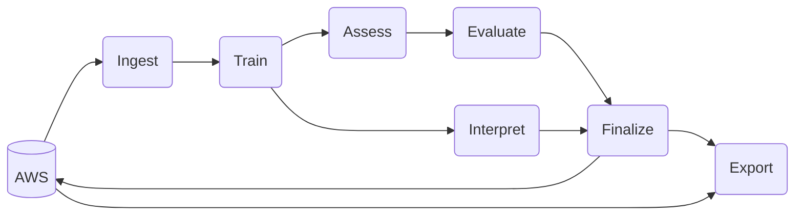

Table of Contents
================

- [Prior Models](#prior-models)
- [Model Overview](#model-overview)
  - [How It Works](#how-it-works)
  - [Choices Made](#choices-made)
    - [Model Selection](#model-selection)
    - [Framework Selection](#framework-selection)
    - [Hyperparameter Selection](#hyperparameter-selection)
    - [Features Used](#features-used)
    - [Data Used](#data-used)
    - [Post-Modeling](#post-modeling)
  - [Major Changes from Previous
    Versions](#major-changes-from-previous-versions)
    - [`assessment-year-2021` and
      prior](#assessment-year-2021-and-prior)
    - [`assessment-year-2022`](#assessment-year-2022)
    - [`assessment-year-2023`](#assessment-year-2023)
- [Ongoing Issues](#ongoing-issues)
  - [Data Quality and Integrity](#data-quality-and-integrity)
  - [Heterogeneity and Extremes](#heterogeneity-and-extremes)
- [FAQs](#faqs)
- [Usage](#usage)
  - [Installation](#installation)
  - [Running](#running)
  - [Parameters](#parameters)
  - [Output](#output)
  - [Getting Data](#getting-data)
  - [System Requirements](#system-requirements)
  - [Troubleshooting](#troubleshooting)
- [License](#license)
- [Contributing](#contributing)

<!-- README.md is generated from README.Rmd. Please edit that file -->

# Prior Models

This repository contains code, data, and documentation for the Cook
County Assessor’s 2023 residential reassessment model. Information about
prior year models can be found at the following links:

| Year(s)     | Triad(s) | Method                                      | Language / Framework       | Link                                                                                               |
|-------------|----------|---------------------------------------------|----------------------------|----------------------------------------------------------------------------------------------------|
| 2009 - 2017 | All      | Linear regression per township              | SPSS                       | [Link](https://gitlab.com/ccao-data-science---modeling/ccao_sf_cama_dev/-/tree/master/code.legacy) |
| 2018        | City     | Linear regression per township              | N/A                        | Not available. Values provided by vendor                                                           |
| 2019        | North    | Linear regression or GBM model per township | R (Base)                   | [Link](https://gitlab.com/ccao-data-science---modeling/ccao_sf_cama_dev)                           |
| 2020        | South    | Linear regression or GBM model per township | R (Base)                   | [Link](https://gitlab.com/ccao-data-science---modeling/ccao_sf_cama_dev)                           |
| 2021        | City     | County-wide LightGBM model                  | R (Tidyverse / Tidymodels) | [Link](https://github.com/ccao-data/model-res-avm/tree/2021-assessment-year)                       |
| 2022        | North    | County-wide LightGBM model                  | R (Tidyverse / Tidymodels) | [Link](https://github.com/ccao-data/model-res-avm/tree/2022-assessment-year)                       |
| 2023        | South    | County-wide LightGBM model                  | R (Tidyverse / Tidymodels) | [Link](https://github.com/ccao-data/model-res-avm/tree/2023-assessment-year)                       |

# Model Overview

The duty of the Cook County Assessor’s Office is to value property in a
fair, accurate, and transparent way. The Assessor is committed to
transparency throughout the assessment process. As such, this document
contains:

- [A brief walkthrough of the overall process used to generate
  residential assessed values](#how-it-works)
- [Rationale for different modeling, feature, and code decisions that
  affect assessed values](#choices-made)
- [An outline of ongoing data quality issues that affect assessed
  values](#ongoing-issues)
- [Instructions to replicate our valuation process and
  results](#installation)

The repository itself contains the [code](./pipeline) and
[data](./input) for the Automated Valuation Model (AVM) used to generate
initial assessed values for single- and multi-family residential
properties in Cook County. This system is effectively an advanced
machine learning model (hereafter referred to as “the model”). It uses
previous sales to generate estimated sale values (assessments) for all
properties.

## How It Works

The ultimate goal of the model is to answer the question, “What would
the sale price of every Cook County home be if it had sold last year?”

To answer this question, the model estimates the sale price (fair market
value) of unsold properties using the known sale price of similar and
nearby properties. Training the model involves iteratively updating a
mathematical function to recognize patterns in sales data, which
includes both [property characteristics (such as square footage, number
of bedrooms, etc.) and additional factors such as location,
environmental variables (flood risk, noise), and market
trends](#features-used).

The full residential modeling pipeline - from raw data to final values -
consists of 7 stages. Visually, the pipeline looks approximately like
the flowchart below.



All inputs and outputs are stored on AWS S3 using a unique run
identifier. Each stage in the modeling pipeline corresponds to an
individual R script. These scripts can be run independently (as a
stand-alone script) or as part of the overall pipeline (with
[DVC](#using-dvc)) as long as the dependencies for the stage exist.

> :warning: NOTE: For a full technical breakdown of each stage,
> including dependencies, outputs, parameters, and more, see
> [dvc.yaml](./dvc.yaml)

0.  **Ingest**: Pull prepared data from the CCAO’s Athena database. This
    data is divided into [2 primary datasets](#data-used), one for
    training and one for assessment. NOTE: This stage is only run
    as-needed, since the input data does not change for each model run.

1.  **Train**: Train the model using sales data. This involves splitting
    the input data into train/test sets and performing cross-validation
    to determine the optimal set of hyperparameters. The primary output
    of this stage is a trained model object.

2.  **Assess**: Use the trained model to estimate values for all
    residential properties. Values are [adjusted if
    necessary](#post-modeling) and then aggregated to the PIN level. The
    primary output of this stage is a data frame of PIN-level assessed
    values.

3.  **Evaluate**: Measure the performance of the model using the
    held-out test set and an assessor-specific ratio study method.
    Performance statistics include standard machine learning metrics
    (RMSE, MAE, MAPE) as well as assessor-specific metrics (COD, PRD,
    PRB). This stage calculates metrics for different levels of
    geography with (and without) property class breakouts. The primary
    output of this stage is a data frame of aggregate performance
    statistics.

4.  **Interpret**: Calculate SHAP values for all the estimated values
    from the assess stage. These are the *per feature* contribution to
    the predicted value for an *individual observation* (usually a
    single PIN). Also calculate the aggregate feature importance for the
    entire model. The primary output of this stage is a data frame of
    the contributions of each feature for each property.

5.  **Finalize**: Add metadata and then upload all output objects to AWS
    (S3). All model outputs for every model run are stored in perpetuity
    in S3. Each run’s performance can be visualized using the CCAO’s
    internal Tableau dashboards.

6.  **Export**: Export assessed values to Desk Review spreadsheets for
    Valuations, as well as a delimited text format for upload to the
    system of record (iasWorld). NOTE: This stage is only run when a
    final model is selected. It is not run automatically or as part of
    the main pipeline.

## Choices Made

Despite its growing reputation as an easy-to-use panacea, machine
learning actually involves a number of choices and trade-offs which are
not always transparent or well-justified. Seemingly inane decisions by
algorithm creators and data scientists [can introduce systemic
bias](https://www.scientificamerican.com/article/how-nist-tested-facial-recognition-algorithms-for-racial-bias/)
into results.

To counter this, we’ve listed the major choices we’ve made about our
modeling process below, as well as the rationale behind each decision.
We feel strongly that these choices lead to optimal results given the
trade-offs involved, but we’re [absolutely open to suggestions and
criticism](#contributing).

### Model Selection

We use [LightGBM](https://lightgbm.readthedocs.io/en/latest/) for our
primary valuation model. LightGBM is a [GBDT (gradient-boosting decision
tree)](https://arogozhnikov.github.io/2016/06/24/gradient_boosting_explained.html)
framework created and maintained by Microsoft. It has [an excellent R
API](https://cran.r-project.org/web/packages/lightgbm/index.html) and
has been around since 2016.

We tried a number of other model types and frameworks, including
regularized linear models,
[XGBoost](https://xgboost.readthedocs.io/en/latest/),
[CatBoost](https://catboost.ai/), random forest, shallow neural
networks, and support vector machines. We even tried ensemble methods
such as [model
stacking](https://github.com/ccao-data/model-res-avm/commit/77de50dce86986f8d442f05c161438933c097958).
We chose LightGBM because it has the right mix of trade-offs for our
needs. Specifically, LightGBM is:

- [Well-documented](https://lightgbm.readthedocs.io/en/latest/). The
  docs contain good explanations of LightGBM’s features and useful
  troubleshooting sections.
- Highly accurate. It consistently beat other methods in accuracy, as
  [measured by RMSE (root mean squared error) using a test set](#faqs).
- Extremely fast. It trained faster than other model types by a nearly
  2:1 margin using our data (CPU training only).
- [Capable of natively handling categorical
  features](https://lightgbm.readthedocs.io/en/latest/Advanced-Topics.html#categorical-feature-support).
  This is extremely important as a large amount of our property data is
  categorical (type of roof, neighborhood, etc.). Other methods, such as
  XGBoost, require feature transformation such as one-hot encoding to
  use categorical data.
- Widely used in housing-specific machine learning models and
  competitions.
- Simpler to use and implement than ensemble methods or neural networks,
  which can involve lots of fiddling and configuration.
- Easy to diagnose problems with, as it has built-in feature importance
  and contribution methods.

The downsides of LightGBM are that it is:

- Relatively difficult to explain compared to simpler models such as
  linear regression.
- Not particularly well-integrated into
  [Tidymodels](https://www.tidymodels.org/), the R framework we use for
  machine learning. See [Framework Selection](#framework-selection).
- Painful to train, since it has a large number of hyperparameters.
- Prone to over-fitting if not trained carefully, unlike other methods
  such as random forest.

### Framework Selection

We use [Tidymodels](https://www.tidymodels.org/) as our primary
machine-learning framework. Tidymodels is a set of R packages that work
well together and with the [Tidyverse](https://www.tidyverse.org/).
These packages abstract away complicated machine-learning logic and
allow us to focus on improving our data and models.

Additionally, Tidymodels is:

- [Well-documented](https://www.tmwr.org/). There are resources for
  quickly learning the Tidymodels approach as well as complete
  documentation for each Tidymodels package.
- [Under very active development](https://github.com/tidymodels).
  Developers are quick to respond to issues and feature requests.
- Quick to teach, since a lot of complicated code is abstracted away.
- [Extensible](https://www.tidymodels.org/learn/develop/models/). The
  API allows for easy integration of additional model types. See
  [Lightsnip](#lightsnip).
- Verbose. It tends to warn you about common machine-learning footguns
  and has excellent error handling and messages.

Some downsides to Tidymodels are that it is:

- Relatively new. While its API is mature, there are still bugs in core
  packages.
- [Under active development](https://github.com/tidymodels). Packages
  and features change fairly quickly, so we need to constantly update
  code to stay current.

##### Lightsnip

We’ve create a custom R package called
[Lightsnip](https://github.com/ccao-data/lightsnip) to better integrate
LightGBM with Tidymodels and unlock some of its more advanced features,
including:

- Early stopping, which reduces training time by stopping based on a
  holdout validation set
- Additional [hyperparameters](#hyperparameter-selection), particularly
  those related to categorical features
- The ability to link certain hyperparameters which typically move in
  tandem, such as `num_leaves` and `max_depth`

Lightsnip also ensures that the link between the model engine (LightGBM)
and the model framework (Tidymodels) is stable. It lets us quickly
respond to any upstream changes while maintaining the set of features we
need.

### Hyperparameter Selection

[Hyperparameters](https://en.wikipedia.org/wiki/Hyperparameter_(machine_learning))
define the structure and trade-offs of models. They must be
well-specified in order for a model to be accurate and useful. LightGBM
has a large number of tunable parameters, but we tune only a small
proportion, including:

| LightGBM Parameter                                                                                 | CV Search Range | Parameter Description                                                              |
|:---------------------------------------------------------------------------------------------------|:----------------|:-----------------------------------------------------------------------------------|
| [num_leaves](https://lightgbm.readthedocs.io/en/latest/Parameters.html#num_leaves)                 | 50 - 2000       | Maximum number of leaves in each tree. Main parameter to control model complexity. |
| [add_to_linked_depth](https://ccao-data.github.io/lightsnip/reference/train_lightgbm.html)         | 1 - 7           | Amount to add to `max_depth` if linked to `num_leaves`. See `max_depth`.           |
| [feature_fraction](https://lightgbm.readthedocs.io/en/latest/Parameters.html#feature_fraction)     | 0.3 - 0.7       | The random subset of features selected for a tree, as a percentage.                |
| [min_gain_to_split](https://lightgbm.readthedocs.io/en/latest/Parameters.html#min_gain_to_split)   | 0.001 - 10000   | The minimum gain needed to create a split.                                         |
| [min_data_in_leaf](https://lightgbm.readthedocs.io/en/latest/Parameters.html#min_data_in_leaf)     | 2 - 300         | The minimum data in a single tree leaf. Important to prevent over-fitting.         |
| [max_cat_threshold](https://lightgbm.readthedocs.io/en/latest/Parameters.html#max_cat_threshold)   | 10 - 250        | Maximum number of split points for categorical features                            |
| [min_data_per_group](https://lightgbm.readthedocs.io/en/latest/Parameters.html#min_data_per_group) | 4 - 300         | Minimum number of observations per categorical group                               |
| [cat_smooth](https://lightgbm.readthedocs.io/en/latest/Parameters.html#cat_smooth)                 | 10 - 200        | Categorical smoothing. Used to reduce noise.                                       |
| [cat_l2](https://lightgbm.readthedocs.io/en/latest/Parameters.html#cat_l2)                         | 0.001 - 100     | Categorical-specific L2 regularization                                             |
| [lambda_l1](https://lightgbm.readthedocs.io/en/latest/Parameters.html#lambda_l1)                   | 0.001 - 100     | L1 regularization                                                                  |
| [lambda_l2](https://lightgbm.readthedocs.io/en/latest/Parameters.html#lambda_l2)                   | 0.001 - 100     | L2 regularization                                                                  |

These parameters are tuned using [Bayesian hyperparameter
optimization](https://www.tidymodels.org/learn/work/bayes-opt/), which
iteratively searches the parameter space based on the previous parameter
tuning results. We use Bayesian tuning instead of grid search or random
search because it trains faster and results in nearly identical final
parameters.

Model accuracy for each parameter combination is measured on a
validation set using [rolling-origin
cross-validation](https://www.tmwr.org/resampling.html#rolling). Final
model accuracy is measured on a test set of the [most recent 10% of
sales](#data-used) in our training sample. For final model candidates,
we also measure model accuracy on a random (rather than time-based) test
set to ensure the model generalizes well.

### Features Used

The residential model uses a variety of individual and aggregate
features to determine a property’s assessed value. We’ve tested a long
list of possible features over time, including [walk
score](https://gitlab.com/ccao-data-science---modeling/models/ccao_res_avm/-/blob/9407d1fae1986c5ce1f5434aa91d3f8cf06c8ea1/output/test_new_variables/county_walkscore.html),
[crime
rate](https://gitlab.com/ccao-data-science---modeling/models/ccao_res_avm/-/blob/9407d1fae1986c5ce1f5434aa91d3f8cf06c8ea1/output/test_new_variables/chicago_crimerate.html),
[school
districts](https://gitlab.com/ccao-data-science---modeling/models/ccao_res_avm/-/blob/9407d1fae1986c5ce1f5434aa91d3f8cf06c8ea1/output/test_new_variables/county_school_boundaries_mean_encoded.html),
and many others. The features in the table below are the ones that made
the cut. They’re the right combination of easy to understand and impute,
powerfully predictive, and well-behaved. Most of them are in use in the
model as of 2023-07-13.

| Feature Name                                                            | Category       | Type        | Possible Values                                                      | Notes                                                                                                                                                                                                                                                                                  |
|:------------------------------------------------------------------------|:---------------|:------------|:---------------------------------------------------------------------|:---------------------------------------------------------------------------------------------------------------------------------------------------------------------------------------------------------------------------------------------------------------------------------------|
| Percent Population Age, Under 19 Years Old                              | ACS5           | numeric     |                                                                      | Percent of the population 17 years or younger. (B01001_003E + B01001_004E + B01001_005E + B01001_006E + B01001_007E + B01001_027E + B01001_028E + B01001_029E + B01001_030E + B01001_031E) / B01001_001E                                                                               |
| Percent Population Age, Over 65 Years Old                               | ACS5           | numeric     |                                                                      | Percent of the population 65 years or older. (B01001_020E + B01001_021E + B01001_022E + B01001_023E + B01001_024E + B01001_025E + B01001_044E + B01001_045E + B01001_046E + B01001_046E + B01001_048E + B01001_049E) / B01001_001E                                                     |
| Median Population Age                                                   | ACS5           | numeric     |                                                                      | Median age for whole population. B01002_001E                                                                                                                                                                                                                                           |
| Percent Population Mobility, In Same House 1 Year Ago                   | ACS5           | numeric     |                                                                      | Percent of people (older than 1 year) who have not moved in the past 12 months. B07003_004E / B07003_001E                                                                                                                                                                              |
| Percent Population Mobility, Moved From Other State in Past Year        | ACS5           | numeric     |                                                                      | Percent of people (older than 1 year) who moved from another state in the past 12 months. B07003_013E / B07003_001E                                                                                                                                                                    |
| Percent Households Family, Married                                      | ACS5           | numeric     |                                                                      | Percent of households that are family, married (married). B11001_003E / B11001_001E                                                                                                                                                                                                    |
| Percent Households Nonfamily, Living Alone                              | ACS5           | numeric     |                                                                      | Percent of households that are non-family, alone (single). B11001_008E / B11001_001E                                                                                                                                                                                                   |
| Percent Population Education, High School Degree                        | ACS5           | numeric     |                                                                      | Percent of people older than 25 who attained a high school degree. (B15002_011E + B15002_028E) / B15002_001E                                                                                                                                                                           |
| Percent Population Education, Bachelor Degree                           | ACS5           | numeric     |                                                                      | Percent of people older than 25 who attained a bachelor degree. (B15002_015E + B15002_032E) / B15002_001E                                                                                                                                                                              |
| Percent Population Education, Graduate Degree                           | ACS5           | numeric     |                                                                      | Percent of people older than 25 who attained a graduate degree. (B15002_016E + B15002_017E + B15002_018E + B15002_033E + B15002_034E + B15002_035E) / B15002_001E                                                                                                                      |
| Percent Population Income, Below Poverty Level                          | ACS5           | numeric     |                                                                      | Percent of people below poverty level. B17001_002E / B17001_001E                                                                                                                                                                                                                       |
| Median Income, Household in Past Year                                   | ACS5           | numeric     |                                                                      | Median income per household in the past 12 months. B19013_001E                                                                                                                                                                                                                         |
| Median Income, Per Capita in Past Year                                  | ACS5           | numeric     |                                                                      | Median income per capita in the past 12 months. B19301_001E                                                                                                                                                                                                                            |
| Percent Population Income, Received SNAP in Past Year                   | ACS5           | numeric     |                                                                      | Percent of households that received SNAP in the past 12 months. B22003_002E / B22003_001E                                                                                                                                                                                              |
| Percent Population Employment, Unemployed                               | ACS5           | numeric     |                                                                      | Percent of people 16 years and older unemployed. B23025_005E / B23025_003E                                                                                                                                                                                                             |
| Median Occupied Household, Total, Year Built                            | ACS5           | numeric     |                                                                      | Median year built for all occupied housing units. B25037_001E                                                                                                                                                                                                                          |
| Median Occupied Household, Renter, Gross Rent                           | ACS5           | numeric     |                                                                      | Median gross rent for only renter-occupied units. B25064_001E                                                                                                                                                                                                                          |
| Percent Occupied Households, Owner                                      | ACS5           | numeric     |                                                                      | Percent of households that are owner-occupied. B25003_002E / B25003_001E                                                                                                                                                                                                               |
| Percent Occupied Households, Total, One or More Selected Conditions     | ACS5           | numeric     |                                                                      | Selected conditions, including: incomplete plumbing or kitchens, overcrowding, 30% or more of the household income spent on rent or monthly owner costs. (B25123_003E + B25123_004E + B25123_005E + B25123_006E + B25123_009E + B25123_010E + B25123_011E + B25123_012E) / B25123_001E |
| Percent Population Mobility, Moved From Within Same County in Past Year | ACS5           | numeric     |                                                                      | Percent of people (older than 1 year) who moved in county in the past 12 months. B07003_007E / B07003_001E                                                                                                                                                                             |
| Year Built                                                              | Characteristic | numeric     |                                                                      |                                                                                                                                                                                                                                                                                        |
| Central Air Conditioning                                                | Characteristic | categorical | Central A/C, No Central A/C                                          |                                                                                                                                                                                                                                                                                        |
| Apartments                                                              | Characteristic | categorical | Two, Three, Four, Five, Six, None                                    | Number of apartments for class 211 and 212 properties. CAUTION: Note the numerically encoded values DO NOT correspond to the number of apartments i.e. code 1 means 2 apartments, code 6 means 0 apartments                                                                            |
| Attic Finish                                                            | Characteristic | categorical | Living Area, Partial, None                                           |                                                                                                                                                                                                                                                                                        |
| Attic Type                                                              | Characteristic | categorical | Full, Partial, None                                                  |                                                                                                                                                                                                                                                                                        |
| Bedrooms                                                                | Characteristic | numeric     |                                                                      | Number of bedrooms in the building                                                                                                                                                                                                                                                     |
| Building Square Feet                                                    | Characteristic | numeric     |                                                                      | Square footage of the building, as measured from the exterior                                                                                                                                                                                                                          |
| Basement Type                                                           | Characteristic | categorical | Full, Slab, Partial, Crawl                                           |                                                                                                                                                                                                                                                                                        |
| Basement Finish                                                         | Characteristic | categorical | Formal Rec Room, Apartment, Unfinished                               |                                                                                                                                                                                                                                                                                        |
| Exterior Wall Material                                                  | Characteristic | categorical | Frame, Masonry, Frame + Masonry, Stucco                              |                                                                                                                                                                                                                                                                                        |
| Full Baths                                                              | Characteristic | numeric     |                                                                      | Number of full bathrooms, defined as having a bath or shower. If this value is missing, the default value is set to 1                                                                                                                                                                  |
| Fireplaces                                                              | Characteristic | numeric     |                                                                      | Number of fireplaces, counted as the number of flues one can see from the outside of the building                                                                                                                                                                                      |
| Garage 1 Area Included                                                  | Characteristic | categorical | Yes, No                                                              | Is Garage 1 physically included within the building area? If yes, the garage area is subtracted from the building square feet calculation by the field agent                                                                                                                           |
| Garage 1 Attached                                                       | Characteristic | categorical | Yes, No                                                              |                                                                                                                                                                                                                                                                                        |
| Garage 1 Ext. Wall Material                                             | Characteristic | categorical | Frame, Masonry, Frame + Masonry, Stucco                              |                                                                                                                                                                                                                                                                                        |
| Garage 1 Size                                                           | Characteristic | categorical | 1 cars, 1.5 cars, 2 cars, 2.5 cars, 3 cars, 3.5 cars, 0 cars, 4 cars |                                                                                                                                                                                                                                                                                        |
| Half Baths                                                              | Characteristic | numeric     |                                                                      | Number of half baths, defined as bathrooms without a shower or bathtub                                                                                                                                                                                                                 |
| Land Square Feet                                                        | Characteristic | numeric     |                                                                      | Square footage of the land (not just the building) of the property. Note that a single PIN can have multiple “land lines,” meaning it can be associated with more than one 200-class land lot                                                                                          |
| Central Heating                                                         | Characteristic | categorical | Warm Air Furnace, Hot Water Steam, Electric Heater, None             |                                                                                                                                                                                                                                                                                        |
| Number of Commercial Units                                              | Characteristic | numeric     |                                                                      | Number of commercial units (the vast majority are for properties with class 212)                                                                                                                                                                                                       |
| Porch                                                                   | Characteristic | categorical | None, Frame Enclosed, Masonry Enclosed                               |                                                                                                                                                                                                                                                                                        |
| Roof Material                                                           | Characteristic | categorical | Shingle + Asphalt, Tar + Gravel, Slate, Shake, Tile, Other           |                                                                                                                                                                                                                                                                                        |
| Rooms                                                                   | Characteristic | numeric     |                                                                      | Number of total rooms in the building (excluding baths). Not to be confused with bedrooms                                                                                                                                                                                              |
| Cathedral Ceiling                                                       | Characteristic | categorical | Yes, No                                                              | Field has not been updated recently enough to be useful for modeling.                                                                                                                                                                                                                  |
| Design Plan                                                             | Characteristic | categorical | Architect, Stock Plan                                                |                                                                                                                                                                                                                                                                                        |
| Type of Residence                                                       | Characteristic | categorical | 1 Story, 2 Story, 3 Story +, Split Level, 1.5 Story, Missing         |                                                                                                                                                                                                                                                                                        |
| Recent Renovation                                                       | Characteristic | logical     |                                                                      | Indicates whether or not a property was renovated within the last 3 years. Renovation is indicated by the char_renovation characteristic flipping from “NO” to “YES”                                                                                                                   |
| Longitude                                                               | Location       | numeric     |                                                                      | PIN location derived from the centroid of the largest polygon associated with the PIN                                                                                                                                                                                                  |
| Latitude                                                                | Location       | numeric     |                                                                      | PIN location derived from the centroid of the largest polygon associated with the PIN                                                                                                                                                                                                  |
| Municipality Name                                                       | Location       | character   |                                                                      | Municipality name for a given PIN. Taken from Cook County GIS shapefiles                                                                                                                                                                                                               |
| FEMA Special Flood Hazard Area                                          | Location       | logical     |                                                                      | Indicator for a PIN within a FEMA Special Flood Hazard Area. Taken from FEMA site for 2021 only                                                                                                                                                                                        |
| First Street Factor                                                     | Location       | numeric     |                                                                      | First Street flood factor (risk score) for a given PIN, scores 1 - 10. Provided to the CCAO by firststreet.org                                                                                                                                                                         |
| First Street Risk Direction                                             | Location       | numeric     |                                                                      | First Street risk direction for a given PIN. Positive scores indicate increasing future flood risk, negative scores the opposite. Provided to the CCAO by firststreet.org                                                                                                              |
| School Elementary District GEOID                                        | Location       | character   |                                                                      | Elementary school district ID for a given PIN. For CPS, elementary school attendance boundaries are used. Taken from Cook County GIS shapefiles                                                                                                                                        |
| School Secondary District GEOID                                         | Location       | character   |                                                                      | Secondary school district ID for a given PIN. For CPS, secondary school attendance boundaries are used. Taken from Cook County GIS shapefiles                                                                                                                                          |
| CMAP Walkability Score (No Transit)                                     | Location       | numeric     |                                                                      | CMAP walkability score for a given PIN, excluding transit walkability. Taken from CMAP’s ON TO 2050 walkability layer                                                                                                                                                                  |
| CMAP Walkability Total Score                                            | Location       | numeric     |                                                                      | CMAP walkability score for a given PIN, including transit walkability. Taken from CMAP’s ON TO 2050 walkability layer                                                                                                                                                                  |
| Airport Noise DNL                                                       | Location       | numeric     |                                                                      | Airport noise calculated via kriging noise monitor data from CDA. See GitLab issue \#70 in the residential modeling repository for more information                                                                                                                                    |
| Township Code                                                           | Meta           | character   |                                                                      | Numeric code identifying the Cook County township of a given PIN                                                                                                                                                                                                                       |
| Neighborhood Code                                                       | Meta           | character   |                                                                      | Assessor neighborhood. First 2 digits are township code, last 3 digits are neighborhood code                                                                                                                                                                                           |
| Tieback Proration Rate                                                  | Meta           | numeric     |                                                                      | Proration rate for a given PIN. Some buildings sit across multiple PINs. This number is intended to capture the split in building value                                                                                                                                                |
| Property Tax Bill Aggregate Rate                                        | Other          | numeric     |                                                                      | Tax bill rate for the taxing district containing a given PIN. Idea is to capture any downward pressure on price from higher tax burdens                                                                                                                                                |
| School District (Elementary) GreatSchools Rating                        | Other          | numeric     |                                                                      | Average Great Schools rating of elementary schools within the district of a given PIN. For CPS, which is a unified school district, the average of schools within attendance boundary is used                                                                                          |
| School District (Secondary) GreatSchools Rating                         | Other          | numeric     |                                                                      | Average Great Schools rating of secondary schools within the district of a given PIN. For CPS, which is a unified school district, the average of schools within attendance boundary is used                                                                                           |
| Number of PINs in Half Mile                                             | Proximity      | numeric     |                                                                      | Number of PINs within half mile of a given PIN. Condo buildings are counted as a single PIN                                                                                                                                                                                            |
| Number of Bus Stops in Half Mile                                        | Proximity      | numeric     |                                                                      | Number of bus stops (CTA or PACE) within half mile of a given PIN. Taken from GTFS feeds retrieved from transitfeeds.com                                                                                                                                                               |
| Number of Foreclosures Per 1000 PINs (Past 5 Years)                     | Proximity      | numeric     |                                                                      | Number of PIN-level foreclosure in the past 5 years, per 1000 PINs, within half mile of a given PIN. Taken from Illinois Public Records <https://public-record.com/login/>                                                                                                             |
| Number of Schools in Half Mile                                          | Proximity      | numeric     |                                                                      | Number of schools within half mile of a given PIN. This includes preschools, small private schools, universities, etc                                                                                                                                                                  |
| Number of Schools with Rating in Half Mile                              | Proximity      | numeric     |                                                                      | Number of schools with Great Schools ratings within half mile of a given PIN                                                                                                                                                                                                           |
| Average School Rating in Half Mile                                      | Proximity      | numeric     |                                                                      | Average Great Schools rating for all schools (with a rating) within half mile of a given PIN. Public schools must be within the same district as the PIN to be considered in the average                                                                                               |
| Nearest Bike Trail Distance (Feet)                                      | Proximity      | numeric     |                                                                      | Distance in feet to the nearest bike trail (linestring). Taken from Cook County GIS shapefiles                                                                                                                                                                                         |
| Nearest Cemetery Distance (Feet)                                        | Proximity      | numeric     |                                                                      | Distance in feet to the nearest cemetery (polygon). Taken from Cook County GIS shapefiles                                                                                                                                                                                              |
| Nearest CTA Route Distance (Feet)                                       | Proximity      | numeric     |                                                                      | Distance in feet to the nearest CTA tracks. Taken from CTA GTFS feeds retrieved via transitfeeds.com                                                                                                                                                                                   |
| Nearest CTA Stop Distance (Feet)                                        | Proximity      | numeric     |                                                                      | Distance in feet to the nearest CTA stop. Taken from CTA GTFS feeds retrieved via transitfeeds.com                                                                                                                                                                                     |
| Nearest Hospital Distance (Feet)                                        | Proximity      | numeric     |                                                                      | Distance in feet to the nearest hospital (polygon). Taken from Cook County GIS shapefiles                                                                                                                                                                                              |
| Lake Michigan Distance (Feet)                                           | Proximity      | numeric     |                                                                      | Distance in feet to the Lake Michigan coastline. Taken from TIGER/Line coastlines file and filtered to Cook County only                                                                                                                                                                |
| Nearest Major Road Distance (Feet)                                      | Proximity      | numeric     |                                                                      | Distance in feet to the nearest major road/highway. Pulled via OpenStreetMap, key=highway, value=motorway,primary,trunk                                                                                                                                                                |
| Nearest Metra Route Distance (Feet)                                     | Proximity      | numeric     |                                                                      | Distance in feet to the nearest Metra tracks. Taken from Metra GTFS feeds retrieved via transitfeeds.com                                                                                                                                                                               |
| Nearest Metra Stop Distance (Feet)                                      | Proximity      | numeric     |                                                                      | Distance in feet to the nearest Metra stop. Taken from Metra GTFS feeds retrieved via transitfeeds.com                                                                                                                                                                                 |
| Nearest Park Distance (Feet)                                            | Proximity      | numeric     |                                                                      | Distance in feet to the nearest park. Pull via OpenStreetMap, key=leisure, value=park                                                                                                                                                                                                  |
| Nearest Railroad Distance (Feet)                                        | Proximity      | numeric     |                                                                      | Distance in feet to the nearest rail (not including CTA). Taken from Cook County GIS shapefiles                                                                                                                                                                                        |
| Nearest Water Distance (Feet)                                           | Proximity      | numeric     |                                                                      | Distance in feet to the nearest water, as identified by Cook County hydrology files                                                                                                                                                                                                    |
| Nearest Golf Course Distance (Feet)                                     | Proximity      | numeric     |                                                                      | Distance in feet to the nearest golf course (polygon). Taken from Cook County GIS shapefiles and OpenStreetMap                                                                                                                                                                         |
| Sale Year                                                               | Time           | numeric     |                                                                      | Sale year calculated as the number of years since 0 B.C.E                                                                                                                                                                                                                              |
| Sale Day                                                                | Time           | numeric     |                                                                      | Sale day calculated as the number of days since January 1st, 1997                                                                                                                                                                                                                      |
| Sale Quarter of Year                                                    | Time           | character   |                                                                      | Character encoding of quarter of year (Q1 - Q4)                                                                                                                                                                                                                                        |
| Sale Month of Year                                                      | Time           | character   |                                                                      | Character encoding of month of year (Jan - Dec)                                                                                                                                                                                                                                        |
| Sale Day of Year                                                        | Time           | numeric     |                                                                      | Numeric encoding of day of year (1 - 365)                                                                                                                                                                                                                                              |
| Sale Day of Month                                                       | Time           | numeric     |                                                                      | Numeric encoding of day of month (1 - 31)                                                                                                                                                                                                                                              |
| Sale Day of Week                                                        | Time           | numeric     |                                                                      | Numeric encoding of day of week (1 - 7)                                                                                                                                                                                                                                                |
| Sale After COVID-19                                                     | Time           | logical     |                                                                      | Indicator for whether sale occurred after COVID-19 was widely publicized (around March 15, 2020)                                                                                                                                                                                       |

#### Data Sources

We rely on numerous third-party sources to add new features to our data.
These features are used in the primary valuation model and thus need to
be high-quality and error-free. A non-exhaustive list of features and
their respective sources includes:

| Feature                                           | Data Source                                                                                                                                                                                                                                                                                              |
|---------------------------------------------------|----------------------------------------------------------------------------------------------------------------------------------------------------------------------------------------------------------------------------------------------------------------------------------------------------------|
| Tax rate                                          | Cook County Clerk’s Office                                                                                                                                                                                                                                                                               |
| Airport noise                                     | Noise monitoring stations via the Chicago Department of Aviation                                                                                                                                                                                                                                         |
| Road proximity                                    | Buffering [OpenStreetMap](https://www.openstreetmap.org/#map=10/41.8129/-87.6871) motorway, trunk, and primary roads                                                                                                                                                                                     |
| Flood indicator                                   | [FEMA flood hazard data](https://hazards.fema.gov/femaportal/prelimdownload/)                                                                                                                                                                                                                            |
| Flood risk and direction                          | [First Street](https://firststreet.org/risk-factor/flood-factor/) flood data                                                                                                                                                                                                                             |
| All Census features                               | [ACS 5-year estimates](https://www.census.gov/programs-surveys/acs/technical-documentation/table-and-geography-changes/2018/5-year.html) for each respective year                                                                                                                                        |
| Elementary school district or attendance boundary | [Cook County school district boundaries](https://datacatalog.cookcountyil.gov/GIS-Maps/Historical-ccgisdata-Elementary-School-Tax-Distric/an6r-bw5a) and [CPS attendance boundaries](https://data.cityofchicago.org/Education/Chicago-Public-Schools-Elementary-School-Attendanc/7edu-z2e8)              |
| High school district or attendance boundary       | [Cook County high school district boundaries](https://datacatalog.cookcountyil.gov/GIS-Maps/Historical-ccgisdata-High-School-Tax-Dist-2016/h3xu-azvs) and [CPS high school attendance boundaries](https://data.cityofchicago.org/Education/Chicago-Public-Schools-High-School-Attendance-Boun/y9da-bb2y) |
| Walkability                                       | The [Chicago Metropolitan Agency for Planning’s](https://www.cmap.illinois.gov/) ON TO 2050 [Walkability Scores](https://datahub.cmap.illinois.gov/dataset/on-to-2050-layer-walkability#:~:text=While%20several%20measures%20of%20walkability,comfortable%2C%20and%20the%20walk%20is)                    |
| Subdivision, unincorporated areas, SSAs, etc.     | Cook County GIS                                                                                                                                                                                                                                                                                          |
| PUMA Housing Index                                | [DePaul Institute for Housing Studies](https://www.housingstudies.org/)                                                                                                                                                                                                                                  |
| School Ratings                                    | [GreatSchools.org](http://greatschools.org/), aggregated to the district level                                                                                                                                                                                                                           |
| Distance to CTA, PACE, Metra                      | Each agency’s respective [GTFS feed](https://gtfs.org/), which contains the location of stops and lines                                                                                                                                                                                                  |

#### Features Excluded

Many people have intuitive assumptions about what drives the value of
their home, so we often receive the question, “Is X taken into account
when valuing my property?” Here’s a list of commonly-asked-about
features which are *not* in the model, as well as rationale for why
they’re excluded:

| Feature                                                | Reason It’s Excluded                                                                                                                                                                                                                      |
|--------------------------------------------------------|-------------------------------------------------------------------------------------------------------------------------------------------------------------------------------------------------------------------------------------------|
| Property condition                                     | We track property condition, but over 98% of the properties in our data have the same condition, meaning it’s not tracked effectively and there’s not enough variation for it to be predictive of sale price.                             |
| Crime                                                  | Crime is highly correlated with features that are already in the model, such as income and neighborhood, so it doesn’t add much predictive power. Additionally, it is difficult to reliably aggregate crime data from all of Cook County. |
| Interior features such as kitchen quality or amenities | Our office can only access the outside of buildings; we can’t reliably observe interior property characteristics beyond what is available through building permits.                                                                       |
| Blighted building or eyesore in my neighborhood        | If a specific building or thing affects sale prices in your neighborhood, this will already be reflected in the model through [neighborhood fixed effects](https://en.wikipedia.org/wiki/Fixed_effects_model).                            |
| Pictures of property                                   | We don’t have a way to reliably use image data in our model, but we may include such features in the future.                                                                                                                              |
| Comparable properties                                  | The model will automatically find and use comparable properties when producing an estimate. However, the model *does not* explicitly use or produce a set of comparable properties.                                                       |

### Data Used

The model uses two primary data sets that are constructed by the [ingest
stage](./pipeline/00-ingest.R), as well as a few secondary data sets for
valuation. These data sets are included in the [`input/`](input/)
directory for the purpose of replication.

#### Primary Data

- [`training_data`](input/training_data.parquet) - Includes residential
  sales from ***the 9 years prior to the next assessment date***, which
  gives us a sufficient amount of data for accurate prediction without
  including outdated price information. This is the data used to train
  and evaluate the model. Its approximate size is 400K rows with 100
  features.
- [`assessment_data`](input/assessment_data.parquet) - Includes all
  residential properties (sold and unsold) which need assessed values.
  This is the data the final model is used on. Its approximate size is
  1.1 million rows with 100 features.

These data sets contain only *residential single- and multi-family
properties*. Single-family includes property
[classes](https://prodassets.cookcountyassessor.com/s3fs-public/form_documents/classcode.pdf)
202, 203, 204, 205, 206, 207, 208, 209, 210, 234, 278, and 295.
Multi-family includes property classes 211 and 212. Bed and breakfast
properties (class 218 and 219) are considered single-family for the sake
of modeling, but are typically valued later by hand. Other residential
properties, such as condominiums (class 299 and 399) are valued [using a
different model](https://github.com/ccao-data/model-condo-avm).

##### Using `training_data`

Models need data in order to be trained and measured for accuracy.
Modern predictive modeling typically uses three data sets:

1.  A training set, used to train the parameters of the model itself.
2.  A validation set, used to choose a hyperparameter combination that
    optimizes model accuracy.
3.  A test set, used to measure the performance of the trained, tuned
    model on unseen data.

`training_data` is used to create these data sets. It is subdivided
using a technique called out-of-time testing.

###### Figure 1: Out-of-Time Testing

Out-of-time testing explicitly measures the model’s ability to predict
recent sales. It holds out the most recent 10% of sales as a test set,
while the remaining 90% of the data is split into training and
validation sets.


###### Figure 2: Rolling-Origin Resampling

The training data is further subdivided using a technique called
rolling-origin resampling. For this method, a fixed window of time is
used to increment the size of the training set, while the validation set
is always 10% of sales immediately following the training set. This
helps cross-validation determine which hyperparameters will perform best
when predicting future sales.


###### Figure 3: Final Training

Once we’re satisfied with the model’s performance on recent sales, we
retrain the model using the full sales sample (all rows in
`training_data`). This gives the final model more (and more recent)
sales to learn from.


##### Using `assessment_data`

Finally, the model, trained on the full sales sample from
`training_data`, can be used to predict assessed values for all
residential properties. To do this, we set the “sale date” of all
properties in `assessment_data` to Jan 1st of the assessment year, then
use the final model to predict what the sale price would be on that
date.

These sale prices are our initial prediction for what each property is
worth. They eventually become the assessed value sent to taxpayers after
some further adjustments (see [Post-Modeling](#post-modeling)) and hand
review.

#### Secondary Data

The pipeline also uses a few secondary data sets in the valuation
process. These data sets are included in [`input/`](./input) but are not
actually used by the model itself. They include:

- [`complex_id_data`](input/complex_id_data.parquet) - Complex
  identifiers for class 210 and 295 town/rowhomes. Intended to group
  like units together to ensure that nearly identical units in close
  proximity receive the same assessed value. This is accomplished with a
  “fuzzy grouping” strategy that allows slightly dissimilar
  characteristics.
- [`land_site_rate_data`](input/land_site_rate_data.parquet) - Fixed,
  PIN-level land values for class 210 and 295 units. Provided by the
  Valuations department.
- [`land_nbhd_rate_data`](input/land_nbhd_rate_data.parquet) - Fixed
  \$/sqft land rates by assessor neighborhood for residential property
  classes except 210 and 295. Provided by the Valuations department.

#### Representativeness

There’s a common saying in the machine learning world: “garbage in,
garbage out.” This is a succinct way to say that training a predictive
model with bad, unrepresentative, or biased data leads to bad results.

To help mitigate the bad data problem and ensure accurate prediction, we
do our best to ensure that the sales data used to train the model is
representative of the actual market and universe of properties. We
accomplish this in two ways.

##### 1. Sales Validation

We use a heuristics-based approach to drop non-arms-length sales, remove
outliers, and manually flag certain suspect sales. The code for this
approach can be found in [`flagging.py`](./py/flagging.py) and was
developed in partnership with the [Mansueto
Institute](https://miurban.uchicago.edu/).

The heuristics classify the following types of outliers using
information about each sale:


We also employ a few additional heuristics that combine statistical
methods with flags derived from the [PTAX-203
form](https://clintonco.illinois.gov/wp-content/uploads/PTAX-203.pdf).
Both the heuristic and PTAX-203 flags can be found in the
`sv_outier_type` column of the [training data](#primary-data).

##### 2. Balance Tests

We also perform basic balance tests to determine if the universe of
properties sold is analogous to the universe of all properties. The code
for these tests can be found under [`reports/`](reports/). The goal of
the tests is to see if any characteristics are significantly predictive
of sale status, and the tests generally take the form of a logistic
regression with the following specification:

    sold_in_last_2_years = β₀ + βₙcharacteristics + βₙlocation_fixed_effects + ... + ε

There a few caveats with this approach and with balance testing in
general:

1.  There could be statistically significant omitted variables that
    differentiate sold from unsold. Things like `recently_painted` or
    `full_kitchen_renovation` are good examples. We don’t collect these
    data points, so it could be the case that sold properties are more
    “sale-ready” in these unknown terms.
2.  There could be significant variation by geography in the
    representativeness of the sales. In other words, certain areas could
    have non-representative sales whose predictive effect on
    `sold_in_last_2_years` is washed out due to mis- or under-specified
    geographic sampling.

### Post-Modeling

In addition to the first-pass modeling done by LightGBM, the CCAO also
performs a set of simple adjustments on the initial predicted values
from the `assess` stage. These adjustments are internally called
“post-modeling,” and are responsible for correcting minor deficiencies
in the first model’s predictions. Specifically, post-modeling will:

1.  Aggregate values for multi-card properties to the PIN level, then
    disaggregate them back to the card level. A check is used to ensure
    that the PIN-level assessed value is not significantly greater than
    the prior year’s value. This is needed because often back buildings
    (ADUs, secondary buildings) will receive a much higher initial value
    than they are actually worth (since they are not differentiated as
    ADUs by the model).

2.  Ensure that nearly identical properties are identically valued. For
    some property classes, such as 210 and 295s, we manually adjust
    values such that all identical properties in the same complex
    receive the same predicted value. This is accomplished by replacing
    individual predicted values with the average predicted value for the
    complex.

3.  Round PIN-level values (typically to the nearest \$1,000). This is
    done to indicate that model values are *estimates*, not precise
    values.

These adjustments have been collectively approved by the senior
leadership of the CCAO. They are designed to limit the impact of data
integrity issues, prevent regressivity in assessment, and ensure that
people with nearly identical properties receive the same value.

## Major Changes from Previous Versions

### [`assessment-year-2021`](https://github.com/ccao-data/model-res-avm/tree/2021-assessment-year) and prior

This repository represents a significant departure from the [residential
modeling
codebase](https://gitlab.com/ccao-data-science---modeling/ccao_sf_cama_dev)
used to create assessed values in 2019 and 2020. As the CCAO’s Data
department has grown, we’ve been able to dedicate more resources to
building models, applications, and other tools. As a result, we’ve made
the following major changes to the residential modeling codebase:

- Reduced the size of the codebase substantially from around 16,000
  lines of R code. This was accomplished by moving complicated data
  handling to our [internal R
  package](https://github.com/ccao-data/ccao) and abstracting away
  machine learning logic to [Tidymodels](https://www.tidymodels.org/).
- Unified modeling for the entire county. Prior iterations of the
  residential model used individual models for each township. This was
  difficult to implement and track and performed worse than a single
  large model. The new model can value any residential property in the
  county, is significantly faster to train, and is much easier to
  replicate.
- Split the residential codebase into separate models for
  [single/multi-family](https://github.com/ccao-data/model-res-avm) and
  [condominiums](https://github.com/ccao-data/model-condo-avm).
  Previously, these models were combined in the same scripts, leading to
  a lot of complications and unnecessary overhead. Separating them makes
  it much easier to understand and diagnose each model.
- Switched to using LightGBM as our primary valuation model. LightGBM is
  essentially the most bleeding-edge machine learning framework widely
  available that isn’t a neural network. Prior to using LightGBM, we
  used linear models or R’s gbm package. Prior to 2018, the CCAO used
  linear models in SPSS for residential valuations.
- Improved dependency management via
  [renv](https://rstudio.github.io/renv/articles/renv.html). Previously,
  users trying replicate our model needed to manually install a list of
  needed R packages. By switching to renv, we’ve vastly reduced the
  effort needed to replicate our modeling environment, see the
  [installation section](#installation) below.

### [`assessment-year-2022`](https://github.com/ccao-data/model-res-avm/tree/2022-assessment-year)

- Moved previously separate processes into this repository and improved
  their integration with the overall modeling process. For example, the
  [etl_res_data](https://gitlab.com/ccao-data-science---modeling/processes/etl_res_data)
  process was moved to [pipeline/00-ingest.R](pipeline/00-ingest.R),
  while the process to [finalize model
  values](https://gitlab.com/ccao-data-science---modeling/processes/finalize_model_values)
  was moved to [pipeline/06-export.R](pipeline/06-export.R).
- Added [DVC](https://dvc.org/) support/integration. This repository
  uses DVC in 2 ways:
  1.  All input data in [`input/`](input/) is versioned, tracked, and
      stored using DVC. Previous input data sets are stored in
      perpetuity on S3.
  2.  [DVC
      pipelines](https://dvc.org/doc/user-guide/project-structure/pipelines-files)
      are used to sequentially run R pipeline scripts and track/cache
      inputs and outputs.
- All model runs are now saved in perpetuity on S3. Each model’s outputs
  are saved as Parquet files which can be queried using Amazon Athena.
- Offloaded model reporting entirely to Tableau. This repository no
  longer produces markdown-based model outcome reports.
- Improved model accuracy significantly while reducing training time.
  This is largely due to the use of
  [Lightsnip](https://github.com/ccao-data/lightsnip) and the inclusion
  of many [new features](#features-used).
- Added per feature, per property contributions via LightGBM’s built-in
  SHAP methods.
- Reorganized the codebase into explicit pipeline stages, each of which
  can be run independently or via DVC.
- Added GitHub [CI integration](./.github), which ensures that any model
  changes don’t result in significant output changes.

### [`assessment-year-2023`](https://github.com/ccao-data/model-res-avm/tree/2023-assessment-year)

- Added updated [sales flagging and validation
  scripts](./py/flagging.py) in partnership with the Mansueto Institute.
  See [Representativeness](#representativeness).
- [Rewrote](1932f0ddd577b4c750940c7ed802136b1fabfeb9) the assessment
  stage for speed and improved accuracy when valuing prorated and
  multi-card PINs.
- Added new [feature
  importance](https://lightgbm.readthedocs.io/en/latest/R/reference/lgb.importance.html)
  output table, which shows the gain, frequency, and cover for each
  model run.
- Added [model QC and balance testing reports](./reports) for ad-hoc
  analysis of model inputs.
- Updated multi-card heuristic to only apply to PINs with 2 cards
  (improvements on the same parcel).
- Updated [townhome complex valuation
  method](98283e36c851d14a770ccb33cbe1fec0557451e4) to prevent
  “chaining” via fuzzy grouping.
- Updated CV implementation so that
  [Lightsnip](https://github.com/ccao-data/lightsnip) and Tidymodels
  share the same validation set: Lightsnip for early stopping,
  Tidymodels for Bayesian optimization.
- Dropped explicit spatial lag generation in the ingest stage.
- Lots of other bugfixes and minor improvements.

# Ongoing Issues

The CCAO faces a number of ongoing issues which make modeling difficult.
Some of these issues are in the process of being solved; others are less
tractable. We list them here for the sake of transparency and to provide
a sense of the challenges we face.

### Data Quality and Integrity

We face a number of data-related challenges that are specific to our
office. These issues are largely the result of legacy data systems,
under-staffing, and the sheer number of properties in Cook County (over
1 million residential properties). We’re actively working to correct or
mitigate most of these issues.

##### Lack of Property Characteristics

Our office tracks around 40 characteristics of individual properties. Of
those 40, about 25 are [usable in modeling](#data-used). The remaining
15 characteristics are too sparse, too dirty, or too unbalanced to use.
Additionally, our data is missing features commonly used in property
valuation, such as:

- Property condition.
- Lot frontage.
- Land slope.
- Percentage of property above grade.
- Quality of finishes.
- Electrical and utility systems.
- Interior characteristics like finish quality, recent remodeling, or
  kitchen quality.
- Any information about pools.
- Information about location desirability or views.

This lack of characteristics contributes to larger errors when modeling,
as it becomes difficult to distinguish between individual properties.
For example, an extremely run-down mansion with otherwise high-value
characteristics (good location, large number of bedrooms) may be
significantly over-assessed, due to our model not accounting for
property condition.

##### Inaccurate Property Characteristics

The property characteristics we track can sometimes be incorrect or
outdated. The two major sources of characteristic errors are:

1.  Data entry or processing errors. Records collected by our office
    often need to digitized and mistakes happen. Fortunately, these
    types of errors are relatively rare.
2.  Characteristic update errors. There are a variety of systems that
    update the characteristics of properties in our system. Some of them
    can be slow to detect changes or otherwise unreliable.

These errors can cause under- *or* over-assessment. If you believe your
property has been misvalued due to a characteristic error or the
property characteristics recorded on our website are incorrect. Please
[contact our office](https://www.cookcountyassessor.com/contact) to file
a property characteristic appeal.

##### Non-Arms-Length Sales

It is difficult for our office to determine whether or not any given
property sale is
[arms-length](https://www.investopedia.com/terms/a/armslength.asp).
Non-arms-length sales, such as selling your home to a family member at a
discount, can bias the model and result in larger assessment errors. We
do our best to [remove non-arms-length sales](#representativeness), but
it’s nearly impossible to know for certain that every transaction is
valid.

##### Incentives Not to Disclose Accurate Information

The Cook County property tax system is complex and can sometimes create
perverse incentives.

For example, most property owners want their property taxes to be as low
as possible, and are thus disincentivized from reporting characteristic
errors which could raise their assessed value. Conversely, if a property
owner plans to sell their home on a listing website, then they have a
strong incentive (the highest possible sale price) to ensure the website
accurately reflects their property’s characteristics. Listing websites
know this and offer easy ways to self-update property attributes.

Additionally, the assessment system has a built-in number of “hard
boundaries” such as property class and assessor neighborhood. These
boundaries create the (mis)perceived incentive to slightly alter the
characteristics of marginal properties. For example, subtracting 10
square feet from a property’s total footprint in order to end up in a
different property class. In actuality, property class has no impact on
predictions from our models.

Falsely altering or not reporting property characteristics may change an
assessed value, but it also has negative consequences for neighbors and
similar properties. High sales on homes with incorrectly reported
characteristics can upwardly bias the model, resulting in
over-assessment for others.

### Heterogeneity and Extremes

In addition to the data challenges that are specific to our office, we
also face the same modeling issues as most assessors and machine
learning practitioners.

##### Housing Heterogeneity

Cook County is an extremely large and diverse housing market. It spans
millions of properties that vary widely in type, age, location, and
quality. In some regions of the county, sales are common; in other
regions, sales are sparse. Accurately estimating the price of such
different properties and regions is a complicated, challenging task.

This challenge is especially acute in areas with high housing
characteristic and price heterogeneity. For example, the Hyde Park
neighborhood in Chicago is home to the University of Chicago and has
large, multi-million-dollar houses near campus. However, sale prices
drop precipitously just a few blocks away, as one passes south of 63rd
street or west of I-90. This sort of sharp price discontinuity makes it
difficult to accurately assess properties, as models tend to “smooth”
such hard breaks unless geographic boundaries are explicitly defined.

Hyde Park is only one example, similarly unique situations exist
throughout the county. Our model *does* account for some of these
situations through neighborhood fixed effects and other location
factors. However, effectively modeling major drivers of heterogeneity is
an ongoing challenge.

##### High and Low-Value Properties

Mass appraisal models need lots of sales data in order to accurately
predict sale prices, but sales become more sparse toward either end of
the price spectrum. The vast majority of properties (over 90%) in Cook
County sell for between \$50K and \$2.5M. Predicting sale prices outside
of that range is difficult; there just aren’t enough representative
sales to train the model effectively.

This issue is particularly prevalent within certain geographies with
unevenly distributed sales. For example, in New Trier township the
average 2021 sale price was around \$1.2 million, compared to the whole
county average of around \$400K. Lower values sales closer to the county
average are rare in New Trier. Due to that rarity, lower value
properties in New Trier are more likely to be overvalued. The same
situation exists in reverse for lower value areas.

This problem isn’t limited to mass appraisal models; predictive models
in general are not good at predicting outliers. We may implement new
machine learning techniques or policies to deal with this issue in the
future.

# FAQs

**Q: My assessed value seems too low or too high. How do I fix it?**

There are over one million residential properties in Cook County
spanning a huge variety of locations, types, ages, and conditions. Mass
appraisal should produce fair valuations for most properties. But a mass
appraisal model isn’t going to accurately value every single property.
If you believe that the value produced by our model is inaccurate,
please [file an
appeal](https://www.cookcountyassessor.com/online-appeals) with our
office.

**Q: My home has been sold recently. Why isn’t my assessed value equal
to my sale price?**

Setting the assessed value of a home equal to the value of a recent sale
is called selective appraisal or sales chasing. Sales chasing can
artificially improve assessment performance statistics and bias
statistical models. Worse, it can bias assessment accuracy in favor of
recently sold properties, giving an unfair advantage to areas or
properties with high turnover. For more information, see [Appendix E of
the IAAO Standard on Ratio
Studies](https://www.iaao.org/media/standards/Standard_on_Ratio_Studies.pdf).

**Q: How are comparables used in the model?**

We don’t use sale or uniformity comparables for the purpose of modeling.
Our model works by automatically finding patterns in sales data and
extrapolating those patterns to predict prices; the model never
explicitly says, “Here is property X and here are Y similar properties
and their sale prices.”

We *do* use [comparables for other
things](https://www.cookcountyassessor.com/what-are-comparable-properties),
namely when processing appeals and when evaluating the model’s
performance.

**Q: What are the most important features in the model?**

The importance of individual features in the model varies from place to
place. Some properties will gain \$50K in value from an additional
bedroom, while others will gain almost nothing. However, some factors do
stand out as more influential:

- Location. Two identical single-family homes, one in Wicker Park, the
  other in Markham, will not receive the same valuation. Location is the
  largest driver of county-wide variation in property value. This is
  accounted for in our model through a number of [location-based
  features](#features-used) such as school district, neighborhood,
  township, and others.
- Square footage. Larger homes tend to be worth more than smaller ones,
  though there are diminishing marginal returns.
- Number of bedrooms and bathrooms. Generally speaking, the more rooms
  the better, though again there are diminishing returns. The value
  added by a second bedroom is much more than the value added by a
  twentieth bedroom.

**Q: How much will one additional bedroom add to my assessed value?**

Our model is non-linear, meaning it’s difficult to say things like,
“Each additional square foot will increase this property’s value by
\$50,” as the relationship between price and individual features varies
from property to property.

We do calculate the contribution of each feature to each property’s
final value. For example, we can say things like, “Your close proximity
to Lake Michigan added \$5,000 to your home’s value.” We’re currently
working on a way to share those feature-level results with property
owners.

**Q: Why don’t you use a simple linear model?**

We decided that performance was more important than the easy
interpretability offered by linear models, and LightGBM tends to
outperform linear models on data with a large number of categorical
features, interactions, and non-linearities.

**Q: How do you measure model performance?**

Assessors tend to use [housing and assessment-specific
measurements](https://www.iaao.org/media/standards/Standard_on_Ratio_Studies.pdf)
to gauge the performance of their mass appraisal systems, including:

- [COD (Coefficient of
  Dispersion)](https://ccao-data.github.io/assessr/reference/cod.html)
- [PRD (Price-Related
  Differential)](https://ccao-data.github.io/assessr/reference/prd.html)
- [PRB (Price-Related
  Bias)](https://ccao-data.github.io/assessr/reference/prb.html)

More traditionally, we use R<sup>2</sup>, root-mean-squared-error
(RMSE), mean absolute error (MAE), and mean absolute percentage error
(MAPE) to gauge overall model performance and fit.

**Q: How often does the model change?**

We’re constantly making minor tweaks to improve the model’s accuracy,
speed, and usability. However, major changes to the model typically take
place during the downtime between reassessments, so about once per year.

# Usage

The code in this repository is written primarily in
[R](https://www.r-project.org/about.html). Please install the [latest
version of R](https://cloud.r-project.org/) (requires R version \>=
4.2.1) and [RStudio](https://posit.co/download/rstudio-desktop/) before
proceeding with the steps below.

If you’re on Windows, you’ll also need to install
[Rtools](https://cran.r-project.org/bin/windows/Rtools/) in order to
build the necessary packages. You may also want to (optionally) install
[DVC](https://dvc.org/doc/install) to pull data and run pipelines.

## Installation

1.  Clone this repository using git, or simply download it using the
    button at the top of the page.
2.  Set your working directory to the local folder containing this
    repository’s files, either using R’s `setwd()` command or
    (preferably) using RStudio’s
    [projects](https://support.rstudio.com/hc/en-us/articles/200526207-Using-Projects).
3.  Install `renv`, R’s package manager, by running
    `install.packages("renv")`.
4.  Install all R package dependencies using `renv` by running
    `renv::restore()`. This step may take awhile. Linux users will
    likely need to install dependencies (via apt, yum, etc.) to build
    from source.

For installation issues, particularly related to package installation
and dependencies, see [Troubleshooting](#troubleshooting).

## Running

#### Manually

To use this repository, simply open the [pipeline/](./pipeline)
directory and run the R scripts in order. Non-CCAO users can skip the
following stages:

- [`pipeline/00-ingest.R`](pipeline/00-ingest.R) - Requires access to
  CCAO internal AWS services to pull data. Use [git LFS](#getting-data)
  instead.
- [`pipeline/05-finalize.R`](pipeline/05-finalize.R) - Requires access
  to CCAO internal AWS services to upload model results.
- [`pipeline/06-export.R`](pipeline/06-export.R) - Only required for
  CCAO internal processes.

#### Using DVC

The entire end-to-end pipeline can also be run using
[DVC](https://dvc.org/). DVC will track the dependencies and parameters
required to run each stage, cache intermediate files, and store
versioned input data on S3.

To pull all the necessary input data based on the information in
`dvc.lock`, run:

``` bash
dvc pull
```

To run the entire pipeline (excluding the export stage), run:

``` bash
dvc repro
```

Note that each stage will run only if necessary i.e. the ingest stage
will *not* run if no parameters related to that stage have changed. To
force a stage to re-run, run:

``` bash
# Change ingest to any stage name
dvc repro -f ingest
```

To force the entire pipeline to re-run, run:

``` bash
dvc repro -f
```

The web of dependencies, outputs, parameters, and intermediate files is
defined via the [`dvc.yaml`](./dvc.yaml) file. See that file for more
information about each stage’s outputs, inputs/dependencies, and related
parameters (defined in [`params.yaml`](./params.yaml)).

## Parameters

All control parameters, hyperparameters, toggles, etc. are stored in
[`params.yaml`](./params.yaml). Almost all modifications to the pipeline
are made via this file. It also contains a full description of each
parameter and its purpose.

Each R script has a set of associated parameters (tracked via
`dvc.yaml`). DVC will automatically detect changes in these parameters
and will re-run stages for which parameters have changed. Stages without
changed parameters or input data are cached and will be automatically
skipped by DVC.

## Output

The full model pipeline produces a large number of outputs. A full list
of these outputs and their purpose can be found in
[`misc/file_dict.csv`](misc/file_dict.csv). For public users, all
outputs are saved in the [`output/`](output/) directory, where they can
be further used/examined after a model run. For CCAO employees, all
outputs are uploaded to S3 via the [finalize
stage](pipeline/05-finalize.R). Uploaded Parquet files are converted
into the following Athena tables:

#### Athena Tables

| Athena Table         | Observation Unit                   | Primary Key                                                                  | Description                                                                           |
|:---------------------|:-----------------------------------|:-----------------------------------------------------------------------------|:--------------------------------------------------------------------------------------|
| assessment_card      | card                               | year, run_id, township_code, meta_pin, meta_card_num                         | Assessment results at the card level AKA raw model output                             |
| assessment_pin       | pin                                | year, run_id, township_code, meta_pin                                        | Assessment results at the PIN level AKA aggregated and cleaned                        |
| feature_importance   | predictor                          | year, run_id, model_predictor_all_name                                       | Feature importance values (gain, cover, and frequency) for the run                    |
| metadata             | model run                          | year, run_id                                                                 | Information about each run, including parameters, run ID, git info, etc.              |
| parameter_final      | model run                          | year, run_id                                                                 | Chosen set of hyperparameters for each run                                            |
| parameter_range      | parameter                          | year, run_id, parameter_name                                                 | Range of hyperparameters searched during CV tuning                                    |
| parameter_search     | model cv fold                      | year, run_id, configuration, fold_id                                         | Tidymodels tuning output from cross-validation                                        |
| performance          | geography \[by class\]             | year, run_id, stage, geography_type, geography_id, by_class, class           | Peformance metrics (optionally) broken out by class for different levels of geography |
| performance_quantile | geography \[by class\] by quantile | year, run_id, stage, geography_type, geography_id, by_class, class, quantile | Performance metrics by quantile within class and geography                            |
| shap                 | card                               | year, run_id, township_code, meta_pin, meta_card_num                         | SHAP values for each feature for each card in the assessment data                     |
| test_card            | card                               | year, meta_pin, meta_card_num                                                | Test set predictions at the card level                                                |
| timing               | model run                          | year, run_id                                                                 | Finalized time elapsed for each stage of the run                                      |

#### Run Types

The pipeline supports 2 types of runs (`run_type` in
[`params.yaml`](params.yaml)): `full` and `limited`. The `full` run type
will run the entire pipeline with all outputs. The `limited` run type
will *only train the model and measure performance on the test set*. It
will not measure performance on the assessment data or calculate SHAP
values.

We recommend using the `limited` run type for testing features and
changes and finalizing with the `full` run type. The table below shoes
breakdown of what is created for each type:

| Athena Table         | Limited Run | Full Run          |
|:---------------------|:------------|:------------------|
| assessment_card      | No          | Yes               |
| assessment_pin       | No          | Yes               |
| feature_importance   | No          | Yes               |
| metadata             | Yes         | Yes               |
| parameter_final      | Yes         | Yes               |
| parameter_range      | No          | If CV enabled     |
| parameter_search     | No          | If CV enabled     |
| performance          | Test only   | Test + assessment |
| performance_quantile | Test only   | Test + assessment |
| shap                 | No          | Yes               |
| test_card            | Yes         | Yes               |
| timing               | Yes         | Yes               |

## Getting Data

The [data required](#data-used) to run these scripts is produced by the
[ingest stage](pipeline/00-ingest.R), which uses SQL pulls from the
CCAO’s Athena database as a primary data source. CCAO employees can run
the ingest stage or pull the latest version of the input data from our
internal DVC store using:

``` bash
dvc pull
```

Public users can download data for each assessment year using the links
below. Each file should be placed in the `input/` directory prior to
running the model pipeline.

#### 2021

- [assmntdata.parquet](https://ccao-data-public-us-east-1.s3.amazonaws.com/models/inputs/res/2021/assmntdata.parquet)
- [modeldata.parquet](https://ccao-data-public-us-east-1.s3.amazonaws.com/models/inputs/res/2021/modeldata.parquet)

#### 2022

- [assessment_data.parquet](https://ccao-data-public-us-east-1.s3.amazonaws.com/models/inputs/res/2022/assessment_data.parquet)
- [complex_id_data.parquet](https://ccao-data-public-us-east-1.s3.amazonaws.com/models/inputs/res/2022/complex_id_data.parquet)
- [land_nbhd_rate_data.parquet](https://ccao-data-public-us-east-1.s3.amazonaws.com/models/inputs/res/2022/land_nbhd_rate_data.parquet)
- [land_site_rate_data.parquet](https://ccao-data-public-us-east-1.s3.amazonaws.com/models/inputs/res/2022/land_site_rate_data.parquet)
- [training_data.parquet](https://ccao-data-public-us-east-1.s3.amazonaws.com/models/inputs/res/2022/training_data.parquet)

#### 2023

- [assessment_data.parquet](https://ccao-data-public-us-east-1.s3.amazonaws.com/models/inputs/res/2023/assessment_data.parquet)
- [complex_id_data.parquet](https://ccao-data-public-us-east-1.s3.amazonaws.com/models/inputs/res/2023/complex_id_data.parquet)
- [land_nbhd_rate_data.parquet](https://ccao-data-public-us-east-1.s3.amazonaws.com/models/inputs/res/2023/land_nbhd_rate_data.parquet)
- [land_site_rate_data.parquet](https://ccao-data-public-us-east-1.s3.amazonaws.com/models/inputs/res/2023/land_site_rate_data.parquet)
- [training_data.parquet](https://ccao-data-public-us-east-1.s3.amazonaws.com/models/inputs/res/2023/training_data.parquet)

For other data from the CCAO, please visit the [Cook County Data
Portal](https://datacatalog.cookcountyil.gov/).

## System Requirements

Both
[Tidymodels](https://tune.tidymodels.org/articles/extras/optimizations.html#parallel-processing)
and
[LightGBM](https://lightgbm.readthedocs.io/en/latest/Parallel-Learning-Guide.html)
support parallel processing to speed up model training. However, the
current parallel implementation in Tidymodels is extremely
memory-intensive, as it needs to carry loaded packages and objects into
each worker process. As such, parallel processing in Tidymodels is
turned **off**, while parallel processing in LightGBM is turned **on**.
This means that models are fit sequentially, but each model fitting is
sped up using the parallel processing built-in to LightGBM. Note that:

- The total amount of RAM needed for overall model fitting is around
  6GB, though this is ultimately dependent on a number of LightGBM
  parameters.
- The number of threads is set via the
  [num_threads](https://lightgbm.readthedocs.io/en/latest/Parameters.html#num_threads)
  parameter, which is passed to the model using the `set_args()`
  function from `parsnip`. By default, `num_threads` is equal to the
  full number of physical cores available. More (or faster) cores will
  decrease total training time.
- This repository uses the CPU version of LightGBM included with the
  [LightGBM R
  package](https://lightgbm.readthedocs.io/en/latest/R/index.html). If
  you’d like to use the GPU version you’ll need to [build it
  yourself](https://lightgbm.readthedocs.io/en/latest/R/index.html#installing-a-gpu-enabled-build)
  or wait for the [upcoming CUDA
  release](https://github.com/microsoft/LightGBM/issues/5153).

## Troubleshooting

The dependencies for this repository are numerous and not all of them
may install correctly. Here are some common install issues (as seen in
the R console) as well as their respective resolutions:

- Error:
  `WARNING: Rtools is required to build R packages, but is not currently installed`
  <br>Solution: Install the latest version of Rtools [from
  CRAN](https://cran.r-project.org/bin/windows/Rtools/), following the
  instructions listed.

- Error:
  `DLL '<package-name>' not found: maybe not installed for this architecture?`
  <br>Solution: Try installing the package manually with the
  `INSTALL_opts` flag set. See
  [here](https://github.com/rstudio/renv/issues/162#issuecomment-612380245)
  for an example.

# License

Distributed under the AGPL-3 License. See [LICENSE](./LICENSE.txt) for
more information.

# Contributing

We welcome pull requests, comments, and other feedback via GitHub. For
more involved collaboration or projects, please see the [Developer
Engagement Program](https://github.com/ccao-data/people#external)
documentation on our group wiki.
